# Emacs Agent Harness

Emacs Agent Harness runs AI coding agents in GNU Emacs. It is written
in Emacs Lisp and supports Claude, GitHub Copilot, DeepSeek,
OpenAI-compatible APIs and AWS Bedrock.

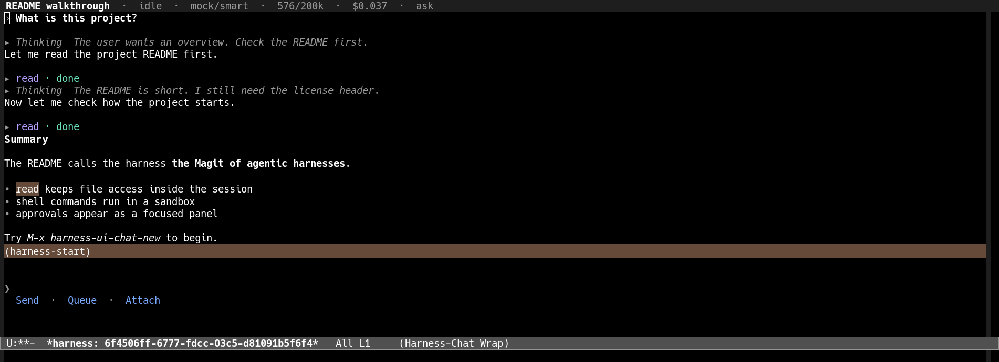

## Features

- **Native Emacs interface.** Chats, the task board, the session list
  and the dashboards are Emacs buffers. They work with the keyboard and
  the mouse and follow your theme.
- **Never blocks your editor.** The harness runs in a separate Emacs
  process, and your Emacs only hosts the UI.
- **Multiple providers.** Claude through the `claude` CLI (subscription
  or API key), GitHub Copilot through the `copilot` CLI, DeepSeek,
  OpenAI-compatible endpoints, and AWS Bedrock.
- **Built-in tools.** Tools for files (read, write, edit, search), the
  shell, the user's Emacs (buffers, windows, showing and editing a
  buffer, saving it, documentation, `*Messages*`), Emacs Lisp
  evaluation in a separate background Emacs, web search and fetch,
  sub-agents and skills, plus tools that let an agent inspect and
  drive other sessions and tasks.
- **Permissions and sandboxing.** Four permission modes (Ask, Accept
  edits, Auto, YOLO), per-session directory access, and a kernel
  sandbox for tool processes (bubblewrap or `systemd-run`).
- **Task board.** Run tasks in parallel, each in its own session and git
  worktree, review the results, and merge them back through a merge
  queue.
- **Notifications.** A desktop notification, and a push to your phone
  through Gotify once you set it up, when a task waits for your review
  or is done. Agents can notify you too.
- **Conversation management.** Fork sessions, ask side questions in
  BTW conversations, browse the conversation tree, and let long
  conversations compact automatically.
- **Cost tracking.** Cost per turn, subscription quotas, budgets and a
  usage dashboard.
- **Remote control.** The harness speaks the Agent Client Protocol
  (ACP), so another Emacs or any ACP client can drive it, including one
  on your phone, paired by scanning a QR code.
- **Modular and reloadable.** Every feature is a module, and the whole
  harness reloads in place without losing running sessions.
- **A companion pet.** Hatch a small creature of a random species and
  rarity that keeps you company in a buffer of its own and now and
  then has a word to say about your work.

## Screenshots

| | |
|---|---|
| 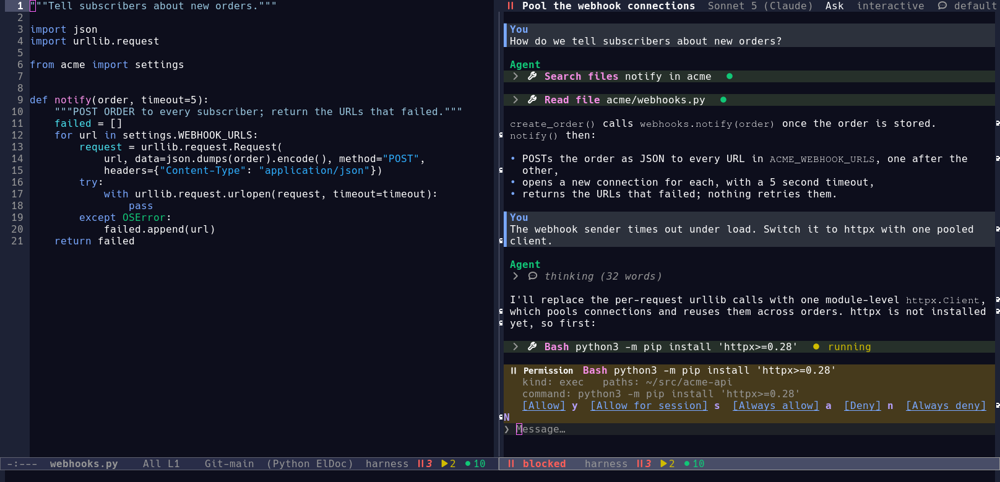 | 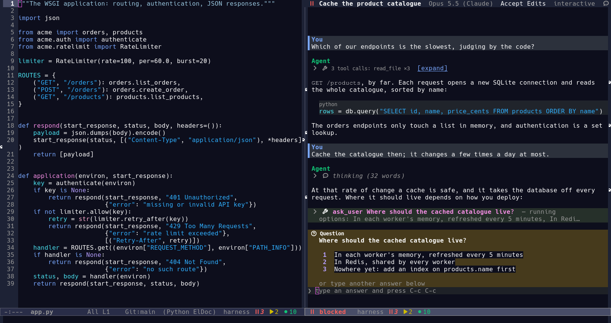 |
| A permission request, answered in the chat | A question from the agent, answered with a digit |
| 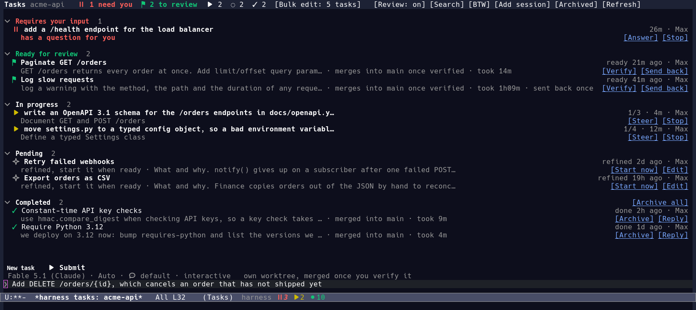 | 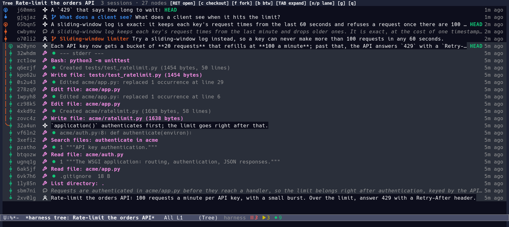 |
| The task board: each task has a session and a worktree | The conversation tree of a session, a fork and a BTW |
| 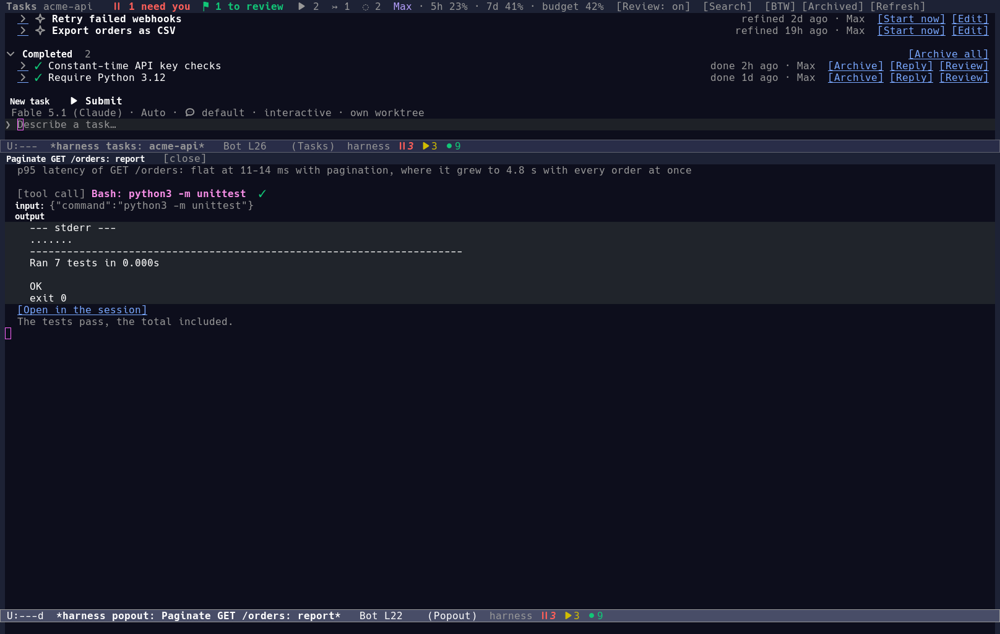 | 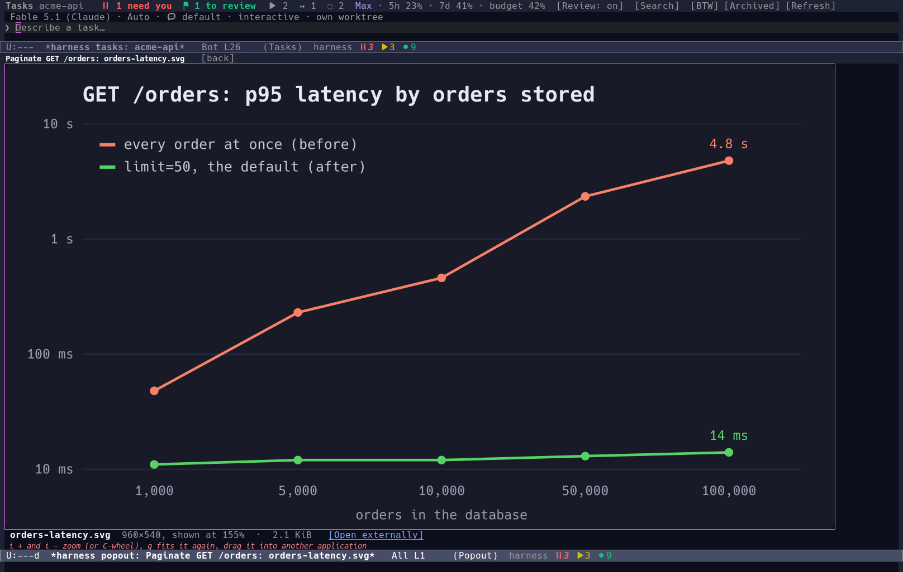 |
| A task's report: verify it or send it back from there | An image of the report, clicked: shown larger |
| 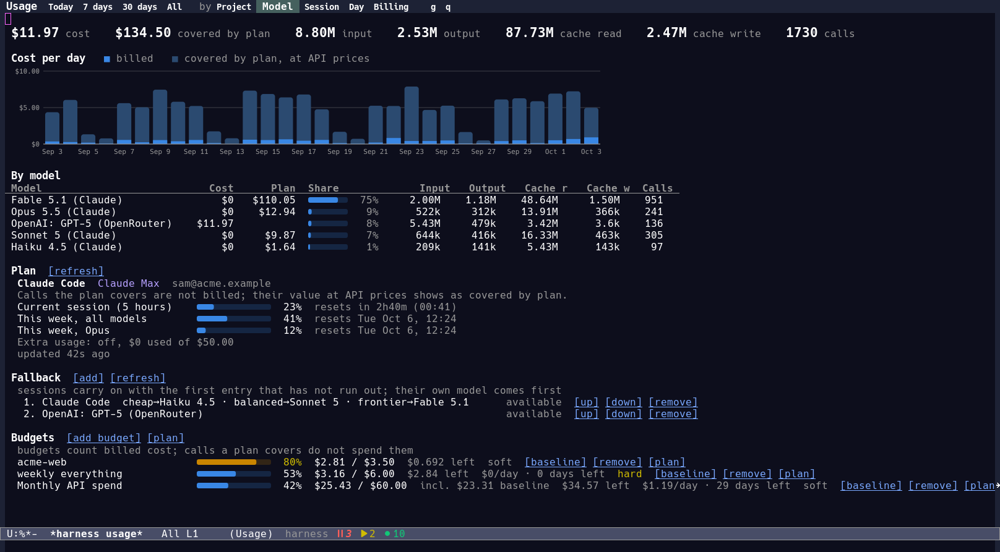 | 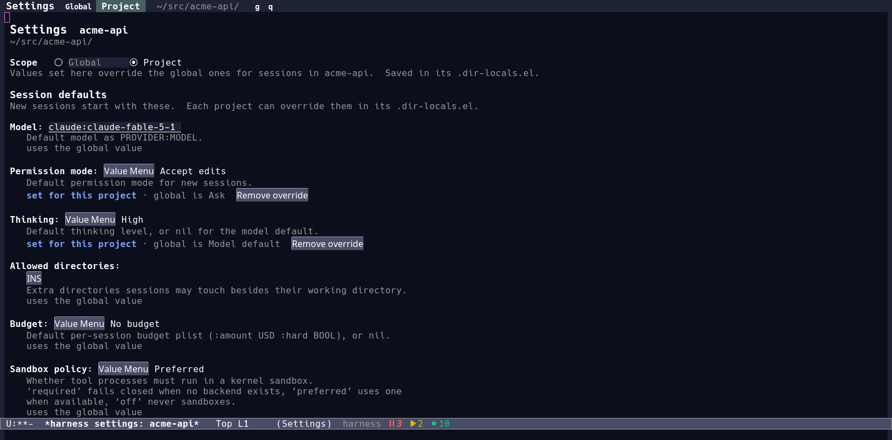 |
| Usage: cost per day and model, plan quota, fallback list, budgets | Settings, here as one project overrides them |
| 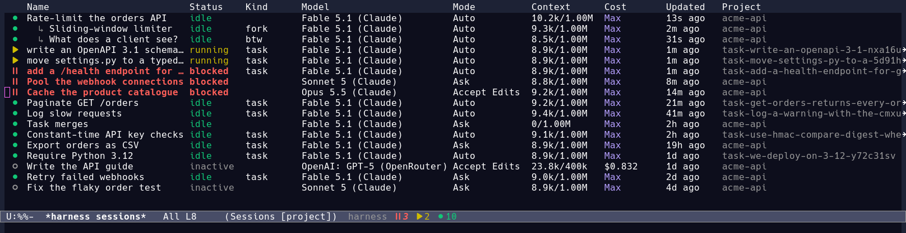 | 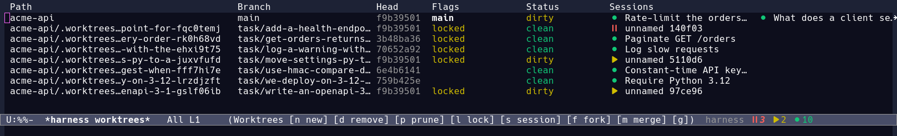 |
| The session list | The worktrees of a project and their sessions |
| 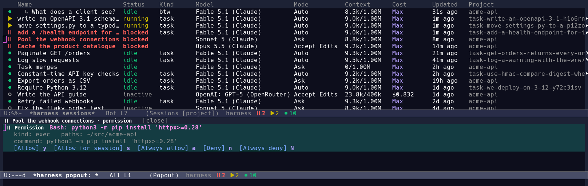 | 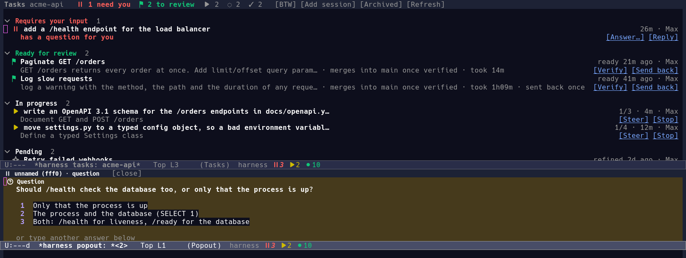 |
| A request popped out of the session list, answered there | A question popped out of the task board, answered there |
| 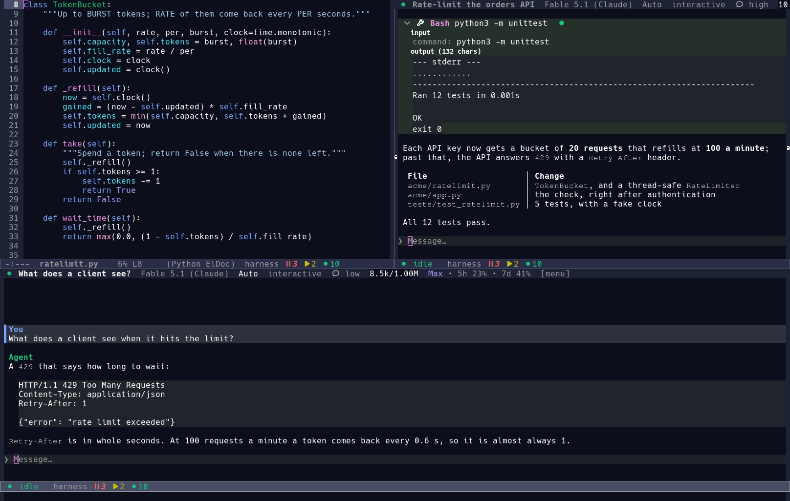 | 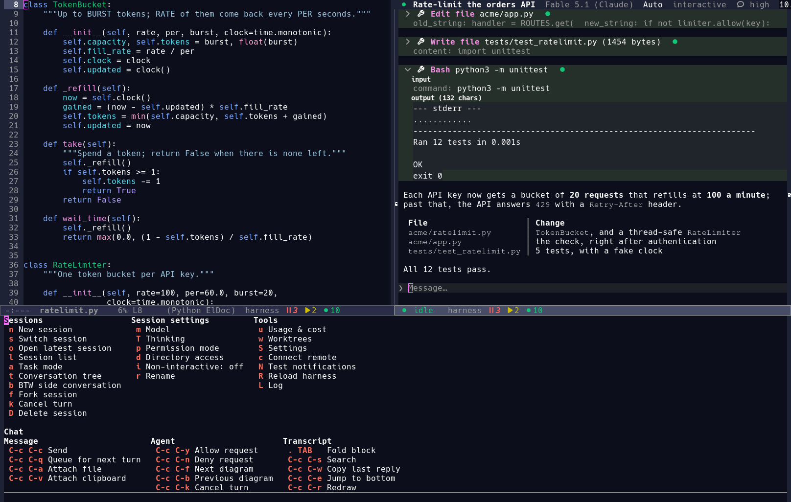 |
| A BTW side conversation under its session | The menu, with the chat's own commands |
| 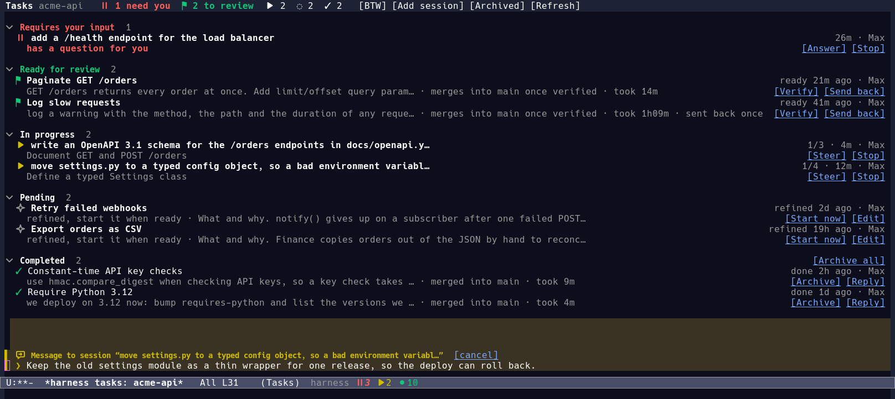 | ![The task board filtered by a search in words: the query, one task matches, the archive it did and [Undo]](docs/media/tasks-search.png) |
| Messaging a task's session: the box says so, in its colours | A search in words: the board shows what it is about, and acts |

## Requirements

- GNU Emacs 29.1 or later
- `curl`
- For the default provider: the `claude` command line (Claude Code),
  logged in

Optional dependencies:

| Dependency | Used for |
|---|---|
| `bwrap` (bubblewrap) | Kernel sandbox for tool processes |
| `rg` (ripgrep) | Faster file search |
| GitHub Copilot CLI 1.0 or later (`copilot`) | Models of a GitHub Copilot plan |
| `OPENROUTER_API_KEY` or `OPENAI_API_KEY` | OpenRouter and OpenAI models |
| `DEEPSEEK_API_KEY` | DeepSeek models, with off-peak pricing tracked |
| An AWS profile or `AWS_BEARER_TOKEN_BEDROCK` | Models on AWS Bedrock |
| `BRAVE_API_KEY` | Web search with any model; until it is set, Claude Code and Copilot sessions use the CLI's own web search (`harness-websearch-builtin`) |
| `ffmpeg`, `mpv` | Audio recording and playback, video posters (playing videos, and the thumbnails and durations shown; `ffprobe` comes with `ffmpeg`) |
| `notify-send` (libnotify), or Emacs with D-Bus support | Desktop notifications on GNU/Linux; macOS uses `osascript` |
| A [Gotify](https://gotify.net) server | Notifications on your phone |

## Installation

### Doom Emacs

In `packages.el`:

```elisp
(package! harness
  :recipe (:host sourcehut :repo "catvec/emacs-agent-harness"
           :files ("harness.el" "lisp" "scripts" "icons")))
```

In `config.el`:

```elisp
(require 'harness)
(harness-start)
```

### straight.el

```elisp
(straight-use-package
 '(harness :host sourcehut :repo "catvec/emacs-agent-harness"
           :files ("harness.el" "lisp" "scripts" "icons")))
(require 'harness)
(harness-start)
```

### Manual installation

Clone the repository:

```sh
git clone https://git.sr.ht/~catvec/emacs-agent-harness ~/src/emacs-agent-harness
```

Then add it to your init file:

```elisp
(add-to-list 'load-path "~/src/emacs-agent-harness")
(require 'harness)
(harness-start)
```

### Updating

`M-x harness-update` (`U` in the `C-c h ?` menu) updates the harness
and reloads it in place, keeping running sessions. It updates the git
checkout the harness runs from: the clone of a manual installation, or
the clone that straight.el keeps for a Doom Emacs or straight.el
installation. It fetches the checkout's upstream branch and, when there
are new commits, first checks the newest one in a separate Emacs,
outside the checkout: `harness.el` must load, and every file must
compile with no merge conflict marker in its code. Only then does it
fast-forward the checkout and run `harness-reload`, which loads the
update in your Emacs and in the harness process. A commit that fails
the check is never installed, and a fast-forward cannot conflict, so
the harness keeps running what it ran until a fixed commit arrives.
The update also changes nothing when the checkout has local changes or
commits of its own. Git and the checking Emacs run in the background,
so Emacs stays responsive. The harness log (`C-c h L`) lists the
commits an update brought in.

The harness has no numbered releases: it follows its `main` branch, so
the commit is the version. `harness-update` names it: the commits it
moved between, or the one it is at when nothing is new.

Package managers can update the harness too, with `doom sync -u` or
`M-x straight-pull-package`. The harness loads its files from the
package manager's git clone rather than from its build directory, so
an update takes effect at the next `harness-reload` or restart, with no
rebuild. A Doom package pinned with `:pin` follows no branch:
`harness-update` refuses it, and you update it by changing the pin.

## Getting started

`harness-start` loads the UI, enables `harness-global-mode` and the
mode line notifier, and starts the harness in the background.

1. Press `C-c h n` and choose the directory the session works in. The
   session opens in a window on the right.
2. Type a message in the compose box at the bottom of the chat buffer
   and press `C-c C-c` to send it.
3. Press `C-c h ?` to open a menu of every command.

When the menu is opened from a harness buffer (a chat, the task board,
the session list, the conversation tree, the worktree list, the usage
dashboard or the directory access list), it also lists that buffer's
own commands under the keys they have there. Key chords such as
`C-c C-c` appear as they are, and single-letter keys appear behind `.`:
for example, `. s` runs what `s` does on the task board.

### Choosing the prefix key

All global commands use the prefix `C-c h`. To use another prefix, set
`harness-ui-prefix-key` with `M-x customize-option` or in your init
file:

```elisp
(setopt harness-ui-prefix-key "C-c x")
```

A value set with `setopt` or Customize takes effect immediately. A
value set with `setq` takes effect only if it is set before
`harness-start`.

### The harness process

The harness runs in its own `emacs --batch` process, so model streams
and tool calls never block your editor. The process receives every
`harness-` variable you set. If its modules need other variables, list
them in `harness-server-forward-variables`, or put the code in a file
named by `harness-server-init-file`.

- `M-x harness-restart` restarts the process with your current
  settings.
- `M-x harness-show-log` (`C-c h L`) shows its log.

## Usage

### Key bindings

| Key | Command | Description |
|---|---|---|
| `C-c h n` | `harness-new-session` | Start a new session in a directory |
| `C-c h s` | `harness-switch-session` | Switch to another session |
| `C-c h o` | `harness-open-latest-session` | Open the newest session of the current project |
| `C-c h O` | `harness-open-session` | Open a session chosen by name |
| `C-c h l` | `harness-sessions` | Show the session list |
| `SPC` | `harness-ui-sessions-requests` | Pop out what the session at point waits on |
| `C-c h a` | `harness-tasks` | Show the task board |
| `C-c h /` | `harness-tasks-search` | Find tasks, or act on them, by saying so in words |
| `C-c h F` | `harness-fullscreen` | Start or end the fullscreen layout: the task board or session list on the left, a session beside it |
| `C-c h t` | `harness-tree` | Show the conversation tree |
| `C-c h f` | `harness-fork-session` | Fork the current session |
| `C-c h b` | `harness-btw` | Open a BTW side conversation |
| `C-c h k` | `harness-cancel-turn` | Cancel the running turn |
| `C-c h D` | `harness-delete-session` | Delete the current session |
| `C-c h m` | `harness-set-model` | Choose the model |
| `C-c h M` | `harness-set-model-all` | Choose a model and switch every current session to it |
| `C-c h T` | `harness-set-thinking` | Choose the thinking level |
| `C-c h H` | `harness-set-thinking-all` | Choose a thinking level and set it on every current session |
| `C-c h p` | `harness-set-permission-mode` | Choose the permission mode |
| `C-c h i` | `harness-toggle-non-interactive` | Toggle non-interactive mode, in which a session never waits for you |
| `C-c h d` | `harness-directories` | Manage the directories a session may access |
| `C-c h u` | `harness-usage` | Show the usage and cost dashboard |
| `C-c h w` | `harness-worktrees` | List the git worktrees of the project |
| `C-c h S` | `harness-settings` | Show the settings page |
| `C-c h z` | `harness-pet` | Show your companion pet, or the egg it hatches from |
| `C-c h r` | `harness-record-audio` | Start or stop recording from the microphone |
| `C-c h c` | `harness-connect-remote` | Connect the UI to a remote harness |
| `C-c h P` | `harness-remote-control` | Pair phones and other devices, and serve them ACP |
| `C-c h R` | `harness-reload` | Reload the harness in place |
| `C-c h L` | `harness-show-log` | Show the harness log |
| `C-c h ?` | `harness-menu` | Open the menu of every command |

The menu (`C-c h ?`) also renames the session (`r`).

With a prefix argument (`C-u`), the commands that open a session ask
where to show it: `right` (the default, see
`harness-ui-default-position`), `left`, `bottom`, `full`, `other` or
`fullscreen` (see [Fullscreen overviews](#fullscreen-overviews)).

### Chat buffers

Each session is shown in a chat buffer: a read-only transcript with an
editable compose box at the bottom. Typing anywhere in the buffer goes
to the compose box, including `?`, so open the menu with `C-c h ?` or
the `[menu]` button in the header line.

| Key | Action |
|---|---|
| `C-c C-c` | Send the message; while the agent is working, it steers the current turn |
| `C-c C-q` | Queue the message for the next turn |
| `RET` | Insert a newline |
| `@` | Complete a file to attach: part of a name finds a project file in any subdirectory, a path (`/`, `~/`, `./`, `../`) any file. An `@path` typed out in full attaches its file when the message is sent, and stays in the text |
| `/` | Complete a skill |
| `C-c C-a` | Attach a file found the same way, by part of a name or by path (`C-u C-c C-a` browses the file system) |
| `C-y` | Attach the image on the clipboard (or the files a file manager copied), keeping `kill-ring` out of it; text yanks as usual |
| `M-y` | Right after a media yank, swap it for an earlier capture; otherwise the usual `yank-pop` |
| `C-c C-y` / `C-c C-n` | Allow or deny the newest permission request |
| `C-c C-p` | Edit the pattern the newest permission request about paths is answered for |
| `C-c C-f` / `C-c C-b` | Show the next or previous diagram of a question's options |
| `C-c C-k` | Cancel the running turn |
| `TAB` | Complete in the compose box; elsewhere, fold or unfold the block at point |
| `C-c C-s` | Search the transcript |
| `C-c C-t` | Show or hide the session's todo list |
| `C-c C-w` | Copy the last reply |
| `C-c C-e` | Jump to the bottom |
| `C-c C-r` | Redraw the buffer |
| `C-c C-z` | Bury the session: its window shows the buffer it showed before (a side window closes) |

Drag a file from your file browser onto a chat or the task board and it
attaches. Drag a *link* — an image from a web page, a video, any address
— and it downloads in the background with curl, behind a chip that shows
a spinner, a progress bar and the size; the file attaches with its own
name when it arrives, and sending waits for it. A link to a web page is
not downloaded: its address goes into the message as text, which is
usually what you wanted. Images and videos show a thumbnail in the
attachment chip (`harness-compose-thumbnail-lines`; videos need
`ffmpeg`), so you can see what you are about to send. Each attachment
has a line of its own above the box, fitted to the window: a long name
is shortened in the middle, and hovering over it shows the whole path.

Images drag *out* too: press on an image in the transcript, on an
attachment chip's thumbnail or name, or on an image of a report or its
larger popout, move the mouse, and drop it on a file manager, a browser
or a chat app, which receives it as a file. A click without moving
still opens the image as before, and letting go over Emacs again
cancels. An image that only exists in the conversation, like a pasted
screenshot, is first written to the session's temporary directory (see
below). Dragging works on a graphical frame where Emacs can start
drags (X, macOS, Haiku), and the hover text says when an image can be
dragged.

Copied an image (in a browser, or with a screenshot tool)? `C-y` in a
compose box attaches it instead of yanking text: it goes on the *media
ring*, a kill ring of its own that only compose boxes read, so no other
mode ever yanks a picture as raw bytes. `M-y` right after goes back
through earlier captures, their thumbnails showing in the box, and
`C-u M-x harness-compose-attach-clipboard` picks one by name. Files
copied in a file manager attach the same way, `yank-media` finds them
too, and `M-x harness-compose-attach-clipboard` chooses among the
clipboard's other MIME types. The box binds no `C-c C-v`: in a chat
that key is the review banner's `[Verify]`, so a screenshot never has
to fight the banner's key. Set
`harness-compose-yank-media` to nil to leave `C-y` and `M-y` alone.

Permission requests and questions from the agent appear inline above
the compose box. An indicator in the mode line, visible from any buffer,
shows how many sessions need your attention. Clicking it opens the
session list, or the waiting session itself when only one needs you.

While the agent works through a todo list (`todo_write`), the list stays
in view: the header line names the progress and the item in hand, and a
panel above the compose box lists every item with its state. `C-c C-t`,
a click on the header segment, or `TAB` on the panel folds the items
away and brings them back; the list disappears when the agent clears it.

A session may use its working directory, its worktree, the directories
in `harness-allowed-directories` and the ones you grant it. It also has
a temporary directory of its own, `/tmp/harness-UID/ID/` (under
`temporary-file-directory`), which needs no grant. The agent keeps
scratch files, logs and screenshots there. Its shell commands can write
there even in the sandbox, where the rest of `/tmp` is private to each
command. The directory is made with the session, made again if it went
missing, and deleted with the session. `C-c h d` lists all of these
directories. Remote sessions have no temporary directory.

A permission request about paths is answered for a glob pattern, not
for a single file. By default the pattern covers everything in the
directory: the directory that holds the file, or the directory itself,
such as `~/notes/**`. The panel shows the pattern on its own line.
Press `e` on the panel, `C-c C-p`, or click `[Edit]` to change it in
the minibuffer, either more specific (`~/notes/*.org`, a subdirectory,
one file) or less (`~/**`). `*` matches within a name and `**` across
directories, and `M-n` offers patterns around the request's own.
Access outside the session's directories grants or denies the
pattern: once, for the session, or always (as an entry of
`harness-allowed-directories`, or a rule in `harness-perms-rules` for
*Always deny*). For a tool call such as a file edit or a command, *Allow
for session*, *Always allow* and *Always deny* hold for that tool on the
pattern only, not for every call of the tool.

A shell command is about what its command line names, not only the
directory it runs in. The prompt for `ls -la ~/.claude/projects/x`,
run in the project, says `runs in: ~/proj` and, below it, `paths:
~/.claude/projects/x`, and offers `~/.claude/projects/x/**`, so the
answer you remember is about that directory and not about every command
run in the project. A command that names nothing outside the session's
directories is about where it runs, as before. Paths are read from the
command line on a best-effort basis: absolute paths, `~` and `$HOME`
paths, and `./` or `../` paths, but not the program being run or
`/dev/null`. An allowing rule must cover every path the command names
outside the session's directories, so allowing commands in the project
does not let one that reaches elsewhere through. A denying rule stops
a command that names any path it covers.

An image the agent reads (`read_file`) shows in the transcript, under
the call's header and outside its fold, so a collapsed call still shows
the picture; so does an SVG, read as text and shown as an image, and a
video attached to a message. A video shows its thumbnail as a poster
under a play button, with its duration and size under it. Click the
poster or the Play button, or press `RET` on it, to play the video with
`mpv`, `ffplay` (`harness-ui-media-video-player`, nil picks the first
installed) or, failing those, the desktop's own player; the poster then
shows Stop. A video `read_file` reads is shown to you and told to the
model, which cannot see it and inspects it with `ffmpeg` instead.

A digit answers a question with that option; any other answer goes in
the compose box. When the options are easier to compare by sight, such
as layouts or architectures, the agent can give each one a diagram,
ASCII art or an image. The diagrams share one area under the options
and show one at a time. Switch between them with the tabs above the
area, `n` and `p` on the panel, `C-c C-f` and `C-c C-b` anywhere in the
buffer, or by moving point onto an option.

The same request can be read and answered without opening the session:
`SPC` in the session list, or on the task board, pops out
what the session at point waits on, in a small window with the same
panel -- the permission prompt or the question in full, its options,
diagrams and keys, and a box for a typed answer. It closes itself once
the request is settled, and the session's own view stays where it was.

The header line shows the session's status, name, todo progress while
it has one, model, permission mode, whether it is `non-interactive` or
`interactive`, thinking level, context and cost. Click the model, the
permission mode, the non-interactive switch or the thinking level to
change it. Switching a session that waits on a permission prompt to
YOLO answers the prompt, since yolo would have allowed the call
anyway; a directory prompt still waits for your answer. A
non-interactive session never waits for you, which suits a session you
leave to work while you are away. Whatever would ask you for
permission, the auto-mode judge decides instead, whatever the
permission mode. The judge runs on the session's own provider: its
cheap tier (Claude Haiku, DeepSeek Flash, or the cheapest model that
provider lists), so a session on one provider is never judged through
another. Set `harness-perms-auto-model` to force one model. The judge
sees only the one call: no conversation, and no project instructions
such as CLAUDE.md. It refuses only what risks serious harm that is
hard to undo, such as wiping data outside the project, force pushes,
system changes, leaking secrets, or widening its own permissions. It
never rules on the task or your workflow, and when in doubt it allows.
A call it would deny is put to you in an interactive session, with the
judge's reason, so you can allow it; in a non-interactive session the
denial stands and the agent is told to find another
way. Access to directories outside the session's own still needs you,
so it is denied while you are away. New sessions, task sessions
included, start interactive unless `harness-non-interactive` is set.
Setting `harness-tasks-non-interactive` makes every new task session
start non-interactive. From then on each
session has its own switch.

Opening an inactive session shows it without resuming it. Its compose
box stays available, and the first message you send resumes it.

### Forks and side conversations

`C-c h f` forks the current session. The fork starts from the
conversation so far and continues independently. A session can be
forked while it works: the tool calls still running finish in the
original session only, so the fork records that they have no result
there.

`C-c h t` shows the conversation tree: every message of the session, its
forks and its BTWs as a git-like graph. On a message, `f` forks the
session there and `c` checks the message out, moving the session's head
back to it. Either way the next message continues from that message: the
model knows the conversation up to it and nothing that came after, which
stays in the tree on its own branch. With Claude Code the CLI's own
conversation is cut at that message, so the fork keeps its cached
prefix. Where nothing can be cut there (Copilot, or a session older than
this), the new conversation gets the transcript up to the message.

`C-c h b` opens a BTW ("by the way") side conversation in a window
below the session. A BTW is a new, empty session that shares nothing
with the session or with other BTWs, which makes it a good place for
quick questions. It has the full chat interface, including the header
line with the model and permission mode, which start from the
session's, the thinking level and whether it is non-interactive. Two
extra controls appear at the front of its header line:

- `[close]` (`C-c C-k`) closes the BTW. A BTW in which nothing was
  asked is deleted.
- `[keep]` (`C-c C-o`) keeps it as a normal session.

So that quick questions get quick answers, a BTW starts at the `low`
thinking level, whatever the session's level is. Set
`harness-btw-thinking` to choose another level, or to nil to start
from the session's level. A BTW whose model does not offer that level
starts at the session's.

### Task board

`C-c h a` opens the task board of the current project. Each task runs in
its own session and, in a git project, normally in its own worktree and
branch, so several tasks can work in parallel; a task that has to touch
your checkout itself can be submitted to the **main tree** instead (the
`own worktree` / `main tree` switch below).

- Write a task in the compose box at the bottom of the board and press
  `C-c C-c` to submit it. `C-c C-t` switches the box between **Submit**,
  which starts the task at once, and **Refine**, which has an agent
  write the task up first. A refined task waits in *Pending*, across
  restarts, until you start it with `s`. Refining looks at the board
  first: a task it already has is refused rather than written up (drop
  it, or write it up anyway), and the write-up names the tasks working
  on the same code, to coordinate with instead of redoing their work.
- Each card is one line, with a subtitle that recaps the task: what it is
  doing or has done so far, written by a short model call and refreshed
  at the first of so many turns, seconds or tool calls since the last
  one, like a warranty's months or miles (see
  `harness-tasks-recap-turns`, `harness-tasks-recap-seconds` and
  `harness-tasks-recap-tool-calls`). The recap shows by default where it
  matters most, in *Requires your input* beside what the task waits for
  and in *Merging* beside where its branch stands; elsewhere `TAB` on a
  card, or a click on its chevron, shows it.
- `C-c h m`, `C-c h T`, `C-c h p` and `C-c h i` set the model, thinking
  level, permission mode and non-interactive mode of the next task, or
  of the task at point. New tasks run in auto mode and are interactive
  unless your configuration says otherwise, so a request that needs
  you, such as access to another directory, waits for you in *Requires
  your input* instead of being denied.
- The `own worktree` / `main tree` switch beside those settings, in a
  git project, picks where the next task works: **own worktree**, on its
  own branch, merged back when it is done, or **main tree**, the
  project's checkout itself, with no branch and nothing to merge. Use
  the main tree for work that has to touch the checkout directly, such
  as cleaning up uncommitted changes; those tasks show `main tree` on
  their card, and a refined task keeps the choice for when you start it.
  An agent can ask for the same thing with `task_submit`'s `main_tree`.
- Task sessions run on at most 256k tokens of context
  (`harness-tasks-context-limit`): they compact sooner than interactive
  sessions, so a long task works from a smaller transcript between
  turns. Set it to another number of tokens to tune that, or to nil to
  give task sessions the whole window like any other session. A
  provider that compacts on its own side keeps its own threshold,
  except Claude Code, which the harness tells to compact at the same
  point.
- A turn is not capped: the harness does not limit how many model calls
  a turn may make, so a task runs as long as the work needs. It ends
  when the agent hands in, the provider stops it (an error, or the
  model hitting its output limit), a merge hold pauses it at a step
  boundary, or you cancel it from its session. Automatic compaction
  (above) runs between turns, so a turn that outgrows the model's
  window reaches the provider's own error; budgets still refuse *new*
  turns once they are spent.
- Finished work waits in *Ready for review*. Press `v` to verify it
  (its branch merges and the task is done) or `R` to send it back to
  its session with feedback. Any message you send to a task waiting
  for review sends it back the same way, with your message as the
  feedback, wherever you write it: in the task's session (no need to
  press `[Send back]` first), with `m` on the board, from another
  device, or from another session. The task goes back to work at once
  and comes back for review when it is done.
- When the project is the harness itself, a card in *Ready for review*
  whose worktree is a checkout of the harness also offers
  `[Open harness]`: it opens an Emacs running that worktree's harness
  in an instance of its own, its frame raised, so the work can be tried
  before it is verified. The agent has the same as the `open_harness`
  tool, which starts such an instance for its own worktree and says how
  to drive it (`scripts/dev.sh` with its socket).
- To skip review, press `V` or click `[Review: on]` in the board's
  header line. Finished tasks then merge and complete without waiting
  for you, and if tasks are already waiting for review, the board offers
  to verify them. The switch sets `harness-tasks-require-verification`,
  so it applies to every project and is saved for later sessions. Press
  `V` again to turn review back on.
- A verified task waits in *Merging* while its branch goes through the
  merge queue: queued for the queue's turn, merging, or, when the merge
  conflicts, a fresh session the harness starts in its worktree
  resolving them (`harness-merge-conflict-resolver`; it spares the
  task's long, long-cold session). The card says where it stands;
  the task moves to *Completed* once the branch is in.
- A task's session finishes by *handing its work in* (`hand_in`): the
  agent gives a final summary and the evidence for it -- an image or a
  video of what it built whenever there is anything to see, a file, a
  code block, a note, or a link to an earlier tool call, the tests or a
  command it ran. The turn ends there and the task waits for your
  review. In the session itself a banner above the compose box shows
  that report in full, already expanded -- the summary, then every piece
  of evidence, a referenced call with its whole output -- and offers
  `[Verify]` (`C-c C-v`), `[Send back]` (`C-c C-x`; type the feedback
  in the box, `C-c C-c` sends it) and `[Report]`, which pops it out, so
  you can read the work and accept it without going back to the board.
  The two keys work only while the banner shows; otherwise `C-c C-v`
  is nothing there, the box pasting with `C-y`.
- `[Report]` on a card that has one, or on the banner, pops the
  handed-in summary and evidence out beside the board: images large, as
  wide as the popout, videos as thumbnails, files as buttons, and each
  referenced tool call as the call it links to, with
  `[Open in the session]`. Click an image, or press `RET` on it, to see
  it larger still in a popout of its own; `q` goes back to the report.
  While the task waits for review, the report ends with the same banner
  as its session: `[Verify]` (`C-c C-v`) and `[Send back]` (`C-c C-x`),
  and a box under it for the feedback (`C-c C-c` sends it), so you can
  read the work and accept it in one place. Once the review is decided
  -- the task verified, or sent back with feedback -- the report closes,
  wherever that was done: from the board, from the session's banner or
  from the report's own banner. The board's item-at-point key (`SPC`)
  opens the report too, along with whatever else the task has to show.
- `I` adds an ongoing session to the board as a task, and `b` opens a
  BTW conversation about the tasks.
- `SPC` on a task that needs input pops out what it waits on -- the
  permission prompt or the question, with its options and diagrams --
  and answers it there. The card offers the same as [Answer…] or
  [Request…] next to [Allow] and [Deny].
- `/` searches the board in words: a question ("did I have a task about
  the question button?") or an order ("restart the errored tasks", "get
  rid of the pagination task"). The line goes with a dump of the board
  to a quick, cheap model (`harness-tasks-search-model`, the provider's
  cheapest tier by default), which answers with the tasks it is about
  and what to do, never with prose. The board then shows only those
  tasks, archived ones included, under a banner that says what it shows;
  `C-g` or `[Clear]` shows every task again. An order that is easily
  undone or does no harm -- archive of a task not at work, restore,
  retry, start -- runs at once and the banner says so, with `[Undo]`;
  one that interrupts work, merges it or sends words to an agent --
  stop, archive of a working task, verify, mark done, message, send
  back -- is offered instead, and an empty `/` then `RET` runs it. The
  model may look further once, in the sessions' transcripts, when the
  board alone does not say enough. `[Search]` in the header does the
  same, and `C-c h /` from anywhere opens the project's board first.
- `RET` opens the session of the task at point. From that session,
  `C-c h a` leads back to the board. `F` lays the board out fullscreen,
  with that session beside it (see
  [Fullscreen overviews](#fullscreen-overviews)).
- A task's session shows in the session list (`C-c h l`) under the
  task's title, of kind task, until the model names it.

Press `?` on the board, or `C-c h ?` in its compose box, to see all of
the board's commands.

### Fullscreen overviews

The task board and the session list can take the whole frame: press `F`
on either, or `C-c h F` from anywhere. The overview stays on the left
and a session shows on the right: the one already in sight, else the
task or session at point, else the most recent one. Every session you
open from the overview takes the right side in turn, and so does
anything else the harness shows while the layout lasts.

- `C-c C-z` in the session on the right buries it: the buffer that was
  there before comes back, such as the file the session took the place
  of, and the layout stays, so the next session you open takes the
  right side again. It is a key chord because plain keys in a session
  type into its compose box.
- `q` on the overview (or `F` again) ends the layout, and the windows
  come back as they were. A file you visited on the right stays in
  sight.
- Opening the other overview while the layout is on (`C-c h l` beside
  the board, say) puts it on the left instead.
- `harness-ui-fullscreen-width` sets the width of the overview: a
  fraction of the frame (half, by default) or a number of columns.
- `fullscreen` is a position too, so `C-u C-c h a` and then `fullscreen`
  opens the board in the layout.

### Notifications

The harness tells you when a task's work waits for your review and
when a task is done, so you can leave it working:

- A desktop notification, shown by your Emacs. Clicking it opens the
  task board on that task. It uses `notify-send` on GNU/Linux (or
  Emacs's D-Bus support) and `osascript` on macOS; set
  `harness-notifications-desktop-backend` to choose.
- A push through [Gotify](https://gotify.net), for your phone, once it
  is set up. Create an application in Gotify and give the harness its
  address and token:

  ```elisp
  (setopt harness-gotify-url "https://push.example.com")
  (setopt harness-gotify-token "AbCdEf123")
  ```

  The token can also come from the `GOTIFY_TOKEN` environment variable
  (the address from `GOTIFY_URL`) or from auth-source:
  `machine push.example.com login harness password AbCdEf123`.

`M-x harness-test-notifications` (`N` in the `C-c h ?` menu) sends a
test notification and says what each provider did with it.

- `harness-notifications-providers` lists the providers used, by
  default `(system gotify)`. One that is not set up is skipped.
- `harness-tasks-notify-events` picks the task events that notify you:
  `review` and `done` by default, and `needs-input` for a task that
  asks a question or stopped part way.
- Agents can notify you with the `notify` tool, for example when long
  work you asked for has finished. Clicking such a notification opens
  the session.

### Companion pet

`C-c h z` (`M-x harness-pet`) opens the pet's buffer, the only place it
shows. The first time there is an egg: press `h` to hatch it. It hatches
into one of 18 species, from common to legendary (one in a hundred),
sometimes with a hat and, rarely, shiny, with five stats. The cheapest
model of your provider names it and gives it a personality.

While its buffer is on screen, it now and then says a line about the
message you just sent, a test run that failed or a big change, and it
always answers when you call it by name in a message or pet it (`p`).
It grows a level as you work. `r` renames it, `m` mutes it and `R` lets
it go, after which the next egg hatches another.

It costs little: it never asks a model anything while its buffer is
hidden or while it is muted, comments unasked at most once a minute
(`harness-pet-cooldown`), on your messages only by chance
(`harness-pet-chance`), and then asks for one short line from a cheap
model (`harness-pet-model`) with no thinking and none of your project's
context but the last few messages. Nothing runs while nothing happens.
To keep it quiet, set
`harness-pet-reactions` to nil; to remove it, add `pet` and `ui-pet` to
`harness-disabled-modules`.

## Configuration

`C-c h S` (`M-x harness-settings`) opens the settings page, which edits
every harness setting like a Customize buffer. A toggle at the top
switches between the global value, saved with Customize, and the value
for the current project, saved in its `.dir-locals.el`. Each setting
shows where its effective value comes from.

The page leads with the settings most people change, grouped by what
they are for: **New sessions** (model, thinking, permission mode,
non-interactive), **Spending** (the budget, one for all sessions
together), **Files and safety** (directory access,
sandbox policy, standing permission rules), **Task board** (what task
sessions start with, and when their work counts as done),
**Notifications** (which task events notify you, and through which
providers) and **Models and services** (extra providers, web search,
keys).

Everything else is under **Advanced**, one click away (`a`), listed by
module, with a count of how many differ from their defaults. The
options of the interface itself (where windows open, the prefix key,
labels, faces) are in Customize, through the button at the end of the
page.

The following settings can be set per project and per directory through
`.dir-locals.el`. A directory's value takes precedence over its
project's, and a project's over the global value.

- `harness-model`
- `harness-thinking`
- `harness-btw-thinking`
- `harness-permission-mode`
- `harness-allowed-directories`
- `harness-sandbox-policy`
- `harness-non-interactive`

The rest of the settings have a global value only.

The number of settings is now small on purpose: prompts, timeouts,
polling intervals, per-tool limits and other details of how the harness
works are constants, not options, so they can change without breaking
anyone's configuration. [docs/configuration-audit.md](docs/configuration-audit.md)
is the audit behind that, and the rule for adding a setting.

Settings that hold records — the OpenAI-compatible and Bedrock
endpoints, Bedrock's per-model defaults, the standing permission rules
— are edited as forms: every key the harness reads is named (Base URL,
Context window, Thinking…), has a value of its own kind, and says what
it is for. Each record in a list folds to one line; `Edit` opens it and
`INS` adds one, filled in from what that kind of record starts as.

Settings that name a model (the default model, the task, refine, recap,
search and auto-mode judge models, Copilot's default model, and the
fallback list) are dropdowns rather than text fields. The button names
the model (`Fable 5.1 (Claude) ▾`), next to its id and context window,
and opens a picker of the models the configured providers list, grouped
by provider, with their context window and price. A pick saves at once.
An id no provider lists can still be typed in the picker, and the page
then warns that the harness does not know that model's context window.

## Providers and billing

### Claude

The default provider drives the `claude` command line. How turns are
billed depends on how it is logged in:

- With an API key (or through Bedrock, Vertex or a gateway token), each
  turn shows what it costs.
- With a Claude subscription (Pro, Max or Team), turns cost nothing per
  token. Sessions show the plan and its quota instead, for example `Max`
  with the 5-hour and weekly windows in the chat header.

Sessions get your CLAUDE.md files, as `claude` loads them, but not
Claude Code's auto memory, the notes Claude Code keeps on each
repository in `~/.claude/projects/`. Harness sessions cannot use those
notes as Claude Code does: the model would read them from outside the
session's allowed directories, so every session would ask you for
access. To give sessions that memory anyway, turn on
`harness-provider-claude-auto-memory` (Claude Code, under Advanced on
the settings page). Reading a note then asks for its directory: answer
Always allow and no session asks again.

### GitHub Copilot

Install GitHub Copilot CLI 1.0 or later with
`npm install -g @github/copilot`, then run `copilot login` once. Copilot
models appear in the model picker (`C-c h m`) as `copilot:` models,
listed from what your plan offers. `copilot:default` stands for
`harness-provider-copilot-default-model`.

Copilot runs the agent loop with the harness's tools only (its own shell
and file tools are disabled) and keeps the conversation, so a session
can resume it after a restart. Each turn shows the AI credits it used at
their dollar value (one credit is $0.01), as covered by the plan. The
month's allowance is shown with the plan's quota, and turns past the
allowance are billed when additional usage is enabled. If `copilot` is
not installed or not logged in, the turn reports it and explains how to
fix it.

### OpenAI-compatible APIs

Each entry of `harness-openai-endpoints` registers an OpenAI-compatible
API as a provider, with models named `ID:MODEL`. OpenRouter
(`OPENROUTER_API_KEY`) and OpenAI (`OPENAI_API_KEY`) are configured by
default.

### DeepSeek

Set `DEEPSEEK_API_KEY` (or `harness-deepseek-api-key`, or an
auth-source entry for `api.deepseek.com`) and `deepseek:` models appear
in the model picker. The provider is created when a key is found and
removed when none is; `harness-deepseek-always-register` keeps it
regardless. Models are `deepseek-flash` (V4.1 Flash, text and images),
`deepseek-v4-pro` and the still-accepted legacy names
`deepseek-v4-flash` and `deepseek-v4-flash-vision-exp`.

DeepSeek prices by the clock: peak hours (01:00-04:00 and 06:00-10:00
UTC, Monday to Friday, except Chinese public holidays) cost double the
off-peak rate. The recorded cost follows the rate in effect and cached
input is billed at the cheaper cache-hit rate. When a call is made in a
peak window, the session is told once, as a hint, and a
`provider/pricing-warning` event fires; nothing is blocked.
`harness-deepseek-pricing` holds the rates, so update it from the
[DeepSeek pricing page](https://api-docs.deepseek.com/quick_start/pricing)
when they change, and extend `harness-deepseek-off-peak-dates` each year
with the Chinese public holiday calendar.

DeepSeek's thinking mode (on by default) requires the reasoning of
earlier assistant turns to come back as `reasoning_content` once a
request carries tools, so the provider replays the recorded thinking of
each assistant message, empty when it has none.  This follows an
official DeepSeek host, so an OpenAI-compatible endpoint you added
yourself at `api.deepseek.com` gets it too, and its cached input is
billed at the cache-hit rate rather than the cache-miss rate; OpenAI
and OpenRouter are unaffected and still drop thinking.  Thinking effort
uses DeepSeek's own three-step ladder — low, high, max — which its
/models route reports, so
the thinking menu offers exactly those levels and never a `medium` or
`xhigh` that DeepSeek would just collapse onto `high`.

### AWS Bedrock

`bedrock:` models run on AWS Bedrock and authenticate with an AWS
profile or a Bedrock API key (`AWS_BEARER_TOKEN_BEDROCK`). See
`harness-bedrock-endpoints` for the configuration.

#### Through a gateway

A gateway or proxy in front of Bedrock gets an endpoint of its own. On
the settings page (`C-c h S`), under **Models and services**, add one
with `INS` to the **Endpoints** described as "AWS Bedrock endpoints"
(the **Endpoints** above it is for OpenAI-compatible APIs). Its **ID**
names its models (`ID:MODEL`). Set **Runtime URL** to the gateway's
URL, path prefix included. For example,
`https://gateway.example.com/bedrock` sends ConverseStream to
`https://gateway.example.com/bedrock/model/MODEL/converse-stream`. A
query in the URL is added to every request.

Models are listed at the same URL (`…/foundation-models` and
`…/inference-profiles`), and never at AWS with the gateway's keys.
If the gateway lists them somewhere else, set **Listing URL**. If it
does not list them at all, set **Models** to name them.

What to set depends on how the gateway authenticates:

| The gateway takes | Set |
|---|---|
| A key of its own as `Authorization: Bearer KEY` | **Authentication** API key, and **API key variable**: the environment variable that holds the key |
| The key in another header, such as `x-api-key` | The same, plus **API key header** `x-api-key` |
| A short-lived token that a command prints | **Authentication** API key, and **API key command** (see below) |
| More headers, such as a team or project id | **Headers**. `${NAME}` in a value is replaced by environment variable `NAME`, so secrets stay out of the settings |
| AWS keys signed for its own URL (API Gateway, a VPC endpoint) | **Authentication** AWS keys, and a **Profile**. For API Gateway, also set **Signing service** to `execute-api` |
| AWS keys signed for Bedrock, because it passes requests on unchanged | **Authentication** AWS keys, and **Sign for Bedrock's own URL** |
| Nothing the harness sends (mutual TLS, a VPN) | **Authentication** None |

The token is the last line the API key command prints; a leading
`Bearer ` is dropped. It is kept until it expires (the `exp` claim of
a JWT), or for an hour otherwise. When the gateway refuses it, the
command runs again and the request is retried once. While a command or
**API key variable** is set, `AWS_BEARER_TOKEN_BEDROCK` is not sent to
the gateway. If the setup is incomplete, the first request names what
is missing.

For example, here is a gateway that takes a key of its own in
`x-api-key` and lists models under its own prefix:

```elisp
(:id gateway :label "Gateway" :auth bearer
 :endpoint-url "https://gateway.example.com/bedrock"
 :bearer-token-env "GATEWAY_API_KEY" :bearer-token-header "x-api-key")
```

And here is one whose token comes from a login command, with its
models named:

```elisp
(:id gateway :label "Gateway" :auth bearer
 :endpoint-url "https://gateway.example.com/bedrock"
 :bearer-token-command "gateway-login --print-token"
 :models ("us.anthropic.claude-sonnet-4-5-20250929-v1:0"))
```

Requests go through curl, so curl's own settings apply:

- `CURL_CA_BUNDLE` for a gateway whose certificate a private CA signs
- `HTTPS_PROXY` and `NO_PROXY` for a proxy
- `~/.curlrc` for anything else, such as `cacert = /path/to/ca.pem`

The harness process takes its environment from Emacs when it starts.
Set the variables before it starts, or restart it after setting them.
Saving the endpoint re-registers its provider and clears what was
cached for it, so a changed URL or model list shows at once.

### Switching model or provider

`C-c h m` (`harness-set-model`) chooses the model for the current
session, and `C-c h T` its thinking level. `C-c h M`
(`harness-set-model-all`) chooses one model and switches every current
session to it; `C-c h H` (`harness-set-thinking-all`) does the same for
the thinking level. Both make the choice the default for new sessions
too, unless a prefix argument (`C-u C-c h M`) says otherwise. Only idle,
running and blocked sessions change — deactivated ones are history and
are left alone — no running turn is cancelled (it takes the new model at
its next step), and each session records the change as a hint. Use them
when a plan runs out of credit, a provider fails, or a cheaper model
should take over work already in flight.

Claude Code and Copilot keep the conversation themselves and are sent
only your newest message, so switching a session to one of them from
another provider would start a conversation that knows nothing of the
work so far. Such a switch asks first — once for all of them with
`C-c h M` — and lists the risks: a cold prompt cache (with what the
session's context costs to write), lower fidelity (the model explores
again; tool calls and thinking reach it only as text), the old
provider's own state left behind, and that a running turn finishes its
current step first. The question shows as a banner over the session's
message box — the models, the risks and the costs, then one button and
key per way to hand over — and as a minibuffer question when the session
has no chat buffer open. Then choose:

- **`c` current model summarises**: it summarises the conversation,
  whose cache is warm, and the new one starts from that summary;
- **`n` new model summarises** (advanced): the new model writes the
  summary itself, from only the first and last messages of the session,
  so the whole conversation never runs through it. Use this when the
  current provider cannot answer at all — its plan ran out, it is down —
  or to keep the job cheap. The middle of the conversation is left out,
  so the summary is a lossy one;
- **`t` full transcript**: the whole transcript is written to
  `.harness/handoff/` in the session's directory (git ignores it), and
  the new model is told to read it before it answers; its prompt cache
  holds it as it reads;
- **`s` no handoff**, or **`q` cancel**.

If the summariser fails, the transcript goes over instead. Whichever
handoff you choose, the message that opens the new conversation says the
context may be lossy and tells the model to re-investigate anything it
is unsure of — read the files, check the state — before it acts.

A switch to an API provider (which is sent the whole conversation), to
another model of the same provider, or back to a provider before any
other ran a step in the session (it resumes its own conversation) loses
nothing and does not ask.

The task board has the same thing scoped to its tasks: turn on bulk edit
(`B`, or `[Bulk edit: N tasks]` in the board's header) and the model,
thinking, permission-mode and interactivity buttons then change every
running, pending and blocked task at once. A conspicuous `EDITING N
CURRENT TASKS` banner shows while it is on, and review, done and
archived tasks are history and are left alone.

### Usage and budgets

The usage dashboard (`C-c h u`) lists every quota window with its reset
time, the plan's extra usage, and the value at API prices that the plan
covered.  Its Fallback section says where sessions carry on when a
provider runs out of quota or money: the list is tried in order, each
entry a provider id (that provider's model of similar ability) or one
model id, set by `harness-fallback-models`.  There `f` adds an entry,
`c` forgets that one ran out so it is tried again, `M-<up>` and
`M-<down>` move the entry at point, and `d` removes it.  A session's
own model always comes first, and it goes back to it once it works
again.

Grouped by project, every task's git worktree is folded under the
project it belongs to: one line per project, with the total and how many
worktrees it holds. `TAB`, `RET` or a click on a project shows its main
checkout's usage and each worktree's, and hides them again; `w` (or
`[show worktrees]`) does it for every project at once.

Budgets count billed cost only. A budget over everything (a day, week
or month budget for no one project) also counts what providers report
they billed in its period beyond what the harness recorded, so one
created partway through a month does not start at $0: a plan's extra
usage this month (Claude Code's usage credits, Copilot's additional
requests) and, with an Anthropic Admin API key
(`harness-anthropic-admin-api-key`), what Anthropic billed per token,
fetched again every ten minutes (`I` fetches it now). The budget's line
says how much, as "incl. $5.00 reported by Claude Code". What was spent
outside the harness that no provider reports, such as a project
budget's spending, which no provider can single out, is a baseline:
press `s` on the budget's line in the dashboard (or use the add-budget
wizard) to set it; it counts until the period rolls over.

## Corporate mode

Corporate mode turns off the harness features that could carry data off
your machine, except web search. It is meant for work machines whose
policy lets code and data go to the model provider in use, and search
queries to a search engine, and nowhere else.

Turn it on in `config.el` (Doom) or your init file, before
`(harness-start)`:

```elisp
(setq harness-corporate-mode t)
```

It turns off:

- Remote control. The harness serves ACP on this machine only and
  ignores `harness-acp-allow-remote`. Pairing phones and other devices
  is refused, and the UI cannot connect to a harness elsewhere
  (`harness-connect-remote`).
- Network tools other than web search. Sessions do not get
  `web_fetch`, which reaches any URL. When a model calls it anyway, the
  call is denied and the model is told why.

It leaves alone:

- The model provider. The provider you choose still receives what
  sessions send it.
- Web search. `web_search` sends its queries to the search provider
  (`harness-websearch-provider`, Brave by default), and Claude Code and
  Copilot run their own web search on their side (see
  `harness-websearch-builtin`). Both are `web_search` calls, which the
  permission rules decide as usual: if your policy rules out web search
  too, add `(:tool "web_search" :behavior deny)` to
  `harness-perms-rules`.
- Shell commands. They follow the permission mode and the sandbox, as
  always, so a command can still reach the network. Use a permission
  mode that asks before commands run (Ask or Accept edits), and set
  `harness-sandbox-policy` to `required` so that no command runs
  outside the sandbox.

The settings page does not list the option, and no ACP client can
change it. If you change it later with `setopt` or Customize, the
harness process restarts so that the change reaches it.

## Persistence

Sessions and tasks are stored in `harness-state-directory` (`harness/`
in your Emacs directory by default). They survive restarts of Emacs and
of the harness process.

- After a restart, sessions stay closed until you open one again
  (`C-c h s` or `C-c h l`), with its whole transcript. A turn that the
  restart interrupted is marked in the transcript.
- The task board comes back as it was. Tasks waiting for review still
  wait, and tasks that were working carry on by themselves. Set
  `harness-tasks-resume-interrupted` to nil to make them wait for you
  instead.

### Task storage in git projects

The tasks of a git project are stored in its repository, in
`.git/harness/tasks.json` of the main checkout. That directory is shared
by all of the repository's worktrees and is not part of any working
tree, so the records never show in `git status`, never get committed
and never get in the way of a merge. Set
`harness-tasks-store-in-repository` to nil to keep them in the state
directory instead.

Tasks saved by earlier versions move into their repositories
automatically. A copy of the file they came from is kept as
`tasks.json.bak` in the state directory.

## Remote control

The harness process serves the
[Agent Client Protocol](https://agentclientprotocol.com) (ACP) on
`127.0.0.1`, on an ephemeral port, with a new token each time it
starts. The address and the token are written to `acp-address` and
`acp-token` in the state directory. Set `harness-acp-token` to choose
the token yourself.

- From another Emacs, `M-x harness-connect-remote` (`C-c h c`) with a
  `host:port` address connects the UI to that harness. An empty address
  connects it back to the local harness. Switching leaves running
  sessions alone. Turns go on, and a permission prompt or question
  already on screen can still be answered after you come back.
- `scripts/harness-acp-stdio` bridges ACP to standard input and output,
  for editors that start ACP agents as subprocesses.

### Pairing a phone

A phone (or any other device on the network) can drive the harness
with an ACP client of its own, such as ACP UI, Agmente or Ferngeist.
ACP defines no way to pair a device, so the harness pairs it with a web
link, which works whatever client the phone uses:

1. Press `C-c h P` to open the remote control page, then `[start
   serving]` (`s`). The harness listens on port 4276 of every network
   interface, for ACP over WebSocket and for ACP's own line framing
   (plain TCP clients such as VACP).
2. Unfold the pairing QR code (`TAB` or a click on its heading). It
   starts folded because the code it carries pairs whichever device
   scans it.
3. Scan the code with the phone's camera and open the link. The page
   that opens says the phone is paired and gives the address to add in
   its ACP client, `ws://ADDRESS:4276/acp`.
4. Add a remote agent with that address in the phone's ACP client and
   connect.

A client that supports ACP authentication can also connect first: the
harness offers it the method "Pair with a QR code", whose answer waits
until the QR code is opened on that device.

Each code works once and expires after ten minutes; unfolding the QR
code again or pressing `n` makes a new one, and hiding it drops it. A
pairing belongs to the device's network address. It lasts while the
device uses it, ends once it goes unused for eight hours, ends when the
harness stops serving, and is never saved. The page lists the paired
devices, and `k` or `[unpair]` unpairs one at once. A WebSocket that a
web page opens is never let in by a pairing, since any page the phone
shows could open one. Clients can authenticate with
`harness-acp-token` instead, as the subprotocol `bearer.TOKEN`, an
`Authorization: Bearer TOKEN` header or `?token=TOKEN` in the address.

The connection is not encrypted. Pair on a network you trust, or over a
VPN such as Tailscale, whose addresses also stay fixed per device. The
page shows the address of this machine that QR codes carry, chosen
among its network interfaces (local network first); `a` picks another.

| Option | Default | Meaning |
|---|---|---|
| `harness-acp-remote` | `nil` | Serve other devices; the page turns it on and off |
| `harness-acp-remote-host` | `"0.0.0.0"` | Address the listener binds |
| `harness-acp-remote-port` | `4276` | Port of the listener |
| `harness-acp-remote-address` | `nil` (detect) | Address of this machine in pairing links |
| `harness-acp-remote-code-lifetime` | `600` | Seconds a pairing code is valid |
| `harness-acp-remote-idle-timeout` | `28800` | Seconds unused before a pairing ends |

Corporate mode turns all of this off.

## Architecture

The core only loads modules and passes messages between them. Every
feature is a module, and the UI talks to the rest of the harness over
ACP, so it works the same with a local or a remote harness.

| Area | Modules |
|---|---|
| Core | `config` `project` `store` `session` `agent` `perms` `sandbox` `usage` `compaction` `handoff` `naming` `skills` `worktree` `merge` `tasks` `notifications` `tasks-notify` `acp` `acp-remote` |
| Providers | `provider` `provider-claude` `provider-copilot` `provider-openai` `provider-deepseek` `provider-bedrock` `provider-demo` |
| Tools | `tools` `tools-fs` `tools-shell` `tools-emacs` `tools-web` `tools-agent` `tools-sessions` `tools-notify` |
| User interface | `ui` `ui-chat` `ui-compose` `ui-sessions` `ui-tasks` `ui-tree` `ui-notify` `ui-usage` `ui-worktree` `ui-btw` `ui-media` `ui-dirs` `ui-config` `ui-qr` `ui-remote` |

Further documentation:

- [DESIGN.md](DESIGN.md): the design the harness implements
- [docs/architecture.md](docs/architecture.md): module contracts
- [docs/ui-guide.md](docs/ui-guide.md): the presentation layer, for
  writing UI modules
- [docs/dev-loop.md](docs/dev-loop.md): the live development loop
- [docs/screenshots.md](docs/screenshots.md): how the screenshots are
  taken, and how to take them again when a view changes

## Development

```sh
scripts/test.sh                              # run every test suite, each in a clean Emacs
scripts/test.sh test/harness-core-test.el    # run one suite (optionally with an ERT selector)
scripts/lint.sh [--checkdoc]                 # byte-compile every file out of tree
scripts/dev.sh start                         # start a clean development Emacs
scripts/media.sh [NAME...]                   # take the screenshots in docs/media again
```

Tests that talk to real models run only when `HARNESS_INTEGRATION=1` is
set. See [docs/dev-loop.md](docs/dev-loop.md) for the full workflow.

`M-x harness-reload` (`C-c h R`) checks and byte-compiles every source
file, then reloads the harness in place, keeping running sessions. If
any file fails to compile, nothing is reloaded. The UI reloads first,
then the harness process. The echo area says whether the process
reloaded every file, some failed to load, or it refused the reload.
`harness-auto-reload-mode` reloads the harness whenever one of its
source files changes.

## License

Emacs Agent Harness is free software, released under the GNU General
Public License, version 3. See [LICENSE](LICENSE) for the full text.
