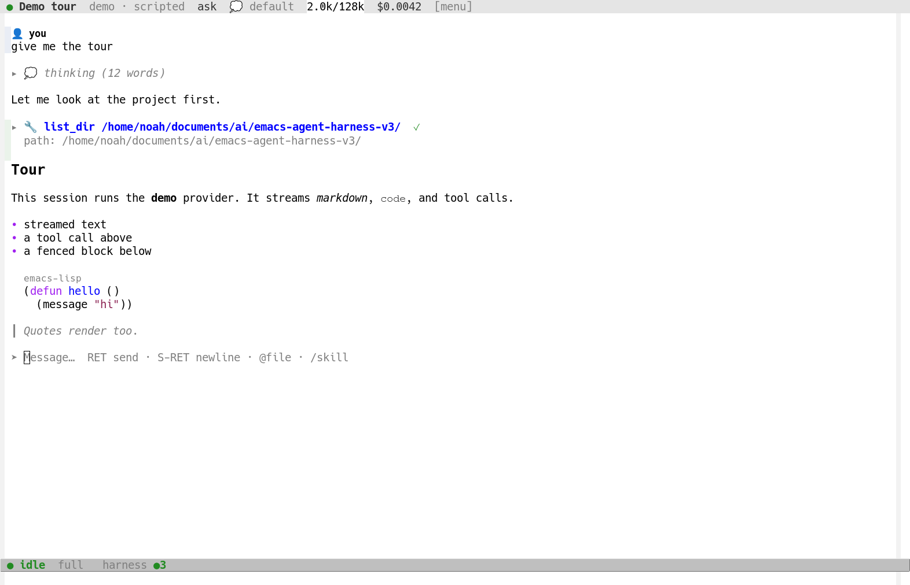
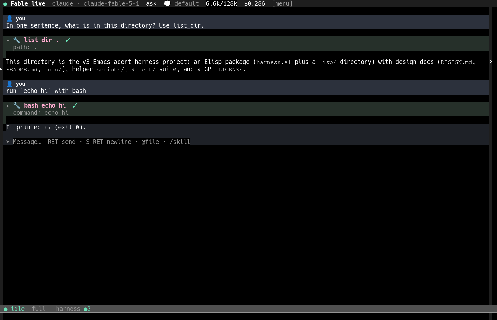

# Emacs Agent Harness (v3)

An agent harness that is native to Emacs: sessions, tools, permissions,
cost tracking and remote control are all Emacs Lisp, the UI is Emacs
buffers, and the default model is Claude Fable 5.1 through the `claude`
command line, so a Claude subscription is enough.  A GitHub Copilot plan
works too: the `copilot` command line brings its models (GPT, Claude,
Gemini and others).



This is a clean-room implementation of [DESIGN.md](DESIGN.md).  The
core only loads modules and passes messages between them; every feature
is a module, and the UI talks to the rest over the Agent Client
Protocol.  The harness runs in its own Emacs process, so nothing it
does can freeze yours; your Emacs keeps only the UI.

## Install

Requires Emacs 29.1 or newer (31.1 is what it is developed on), `curl`,
and the `claude` CLI logged in for the default provider.  Optional:
`bwrap` for the kernel sandbox, `rg` for fast search, the `copilot` CLI
(GitHub Copilot CLI 1.0 or newer, `npm install -g @github/copilot`, then
`copilot login` once) for the models of a Copilot plan,
`OPENROUTER_API_KEY` or `OPENAI_API_KEY` for OpenAI-compatible
providers, an AWS profile or a Bedrock API key
(`AWS_BEARER_TOKEN_BEDROCK`) for models on AWS Bedrock (`bedrock:`
models, see `harness-bedrock-endpoints`), `BRAVE_API_KEY` for web
search.

```elisp
;; straight / Doom
(package! harness :recipe (:host sourcehut :repo "catvec/emacs-agent-harness"
                           :files ("harness.el" "lisp" "scripts")))

;; or a plain checkout
(add-to-list 'load-path "~/src/emacs-agent-harness")
(require 'harness)
(harness-start)          ; loads the UI and starts the harness process
```

`harness-start` enables `harness-global-mode` (prefix `C-c a`) and the
mode line notifier, then starts the harness as `emacs --batch` in the
background.  It gets every `harness-` variable you set; list other
variables it needs in `harness-server-forward-variables`, or put code in
`harness-server-init-file`.  `M-x harness-restart` restarts it with your
current settings; its log is in `M-x harness-show-log`.  `M-x harness-menu` (`C-c a ?`) shows everything.
Opened from a harness buffer (a chat, the task board, the session list,
the tree, worktrees, usage, directory access) it also lists that
buffer's own commands under the keys they have there: chords such as
`C-c C-c` as they are, a board's letters behind `.` (`. s` runs what `s`
does on the task board).

## Use

| key | command |
|---|---|
| `C-c a n` | new session in a directory (opens on the right by default) |
| `C-c a s` / `C-c a l` | switch session / session list |
| `C-c a a` | task mode: a board of one-session tasks, each in its own worktree; finished work waits in Ready for review until you verify it (`v`: its branch merges and the task is done) or send it back with feedback (`R`: its session works on it again), unless `harness-tasks-require-verification` is nil; `I` adds an ongoing session, `b` asks how the tasks are going in a BTW side conversation, and `C-c a m` `T` `p` `i` set the next task up (or change the task at point); `C-c C-t` switches the box between Submit (start now) and Refine (backlog refinement: an agent writes the task up and it waits in Pending, across restarts, until `s` starts it) |
| `C-c a m` `T` `p` `i` | model, thinking level, permission mode, and `i` toggles non-interactive mode: a non-interactive session never waits for you, since what would ask for permission is denied and the agent is told to find another way.  The chat's header line shows each of them; click one to change it |
| `C-c a f` / `C-c a b` | fork the session / BTW side conversation: a new, empty session in a side window under the session, sharing nothing with it or with other BTWs, point in its compose box (ask with `C-c C-c` as in any session).  It is the full chat UI, header line included (model, permission mode and thinking, starting from the session's, and whether it is non-interactive), with `[close]` and `[keep]` in front: `C-c C-k` closes it, deleting it if nothing was asked, `C-c C-o` keeps it as a normal session |
| `C-c a t` `u` `w` | conversation tree, usage dashboard, worktrees |
| `C-c a S` | settings: every harness setting on one page, edited globally or for the current project (`s` switches) |
| `C-c a k` | cancel the running turn |
| `C-c a c` | connect the UI to a remote harness |
| `C-c a R` | reload the harness in place |

In a chat buffer: `C-c C-c` sends (steering the agent if it is mid-turn),
`RET` inserts a newline, `C-c C-k` cancels the turn, `C-c C-q` queues
for the next turn, `@` completes project files as attachments (part of
a name finds a file in any subdirectory), `/` completes skills,
`C-c C-a` attaches a project file found the same way (`C-u C-c C-a`:
any file), `C-c C-v` pastes a clipboard image, `TAB` folds a block.
Typing anywhere goes to the compose box, `?` included, so the menu is
`C-c a ?` there (or the `[menu]` button in the header line).
The header line shows the session's model, permission mode, whether it
is `non-interactive` or `interactive`, and thinking level; clicking one
changes it.  A session starts non-interactive when
`harness-non-interactive` is set (task sessions: while
`harness-tasks-non-interactive` is), and from then on has its own switch.
Permission and question panels appear inline above the compose box; the
mode line shows how many sessions need you from any buffer.
Opening a closed (inactive) session shows it without waking it; it keeps
its compose box, and the first message you send resumes it.

Costs follow how the `claude` CLI is logged in.  With an API key (or
Bedrock, Vertex, a gateway token) each turn shows what it costs.  With
a Claude subscription (Pro, Max, Team) turns cost nothing per token.
The session shows its plan and quota instead, for example `Max` with
the 5-hour and weekly windows in the chat header, and the usage
dashboard (`C-c a u`) lists every quota window with its reset time, the
plan's extra usage, and the value at API prices the plan covered.
Budgets count billed cost only.  A budget made in the middle of a month
can start from what was already spent outside the harness: `s` on its
line in the dashboard (or the add-budget wizard) sets that baseline,
which counts until the period rolls over.  An organisation billed per
token can fetch it instead: with an Anthropic Admin API key
(`harness-anthropic-admin-api-key`), `I` on a month budget offers the
month's API cost less what the harness recorded.

GitHub Copilot models are the `copilot:` ones in the model picker
(`C-c a m`), listed from what your plan offers; `copilot:default` stands
for `harness-provider-copilot-default-model`.  Copilot runs the agent
loop with the harness's tools only (its own shell and file tools are
off) and keeps the conversation, so a session resumes it after a
restart.  The plan pays: each turn shows the AI credits it used at
their dollar value (a credit is $0.01) as covered by the plan, the
month's allowance shows with the plan's quota, and turns past the
allowance with additional usage on are billed.  When `copilot` is not
installed or not logged in, a turn says so and how to fix it.

Settings persist through `.dir-locals.el` (project, then directory) and
customize (global); the settings page (`C-c a S`, `M-x harness-settings`)
edits them like a customize buffer, with a Global / Project toggle at
the top, and shows where each value in effect comes from.  These layer:
`harness-context-reserve`, `harness-model`, `harness-permission-mode`,
`harness-thinking`, `harness-allowed-directories`, `harness-budget`,
`harness-sandbox-policy`, `harness-non-interactive`,
`harness-tasks-directory`.  The page lists the other harness options
too; they have a global value only.

Sessions and tasks live in `harness-state-directory` (`harness/` in your
Emacs directory by default) and survive restarts of Emacs and of the
harness process.  A git project's tasks live inside its repository
instead, in `.git/harness/tasks.json` of the main checkout: the git
directory all of its worktrees share and no working tree contains, so
the records never show in `git status`, never get committed and never
get in the way of a merge (`harness-tasks-store-in-repository` nil keeps
them in the state directory too).  Tasks from before that move into
their repositories by themselves; `tasks.json.bak` in the state
directory keeps a copy of the file they came from.
After a restart sessions are closed until you open one again (`C-c a s`,
`C-c a l`), with its whole transcript; a turn the restart cut short is
marked in it.  The task board comes back as it was, tasks waiting for
your review still wait, and tasks that were working carry on by
themselves (`harness-tasks-resume-interrupted` nil makes them wait for
you instead).

A git project's board is also a folder of markdown files, one per task,
in `docs/tasks/` of the main checkout (`harness-tasks-directory`; a
project's `.dir-locals.el` may name another folder, or nil for none).
Each file has YAML frontmatter (`id`, `title`, `state`, `column`,
`session`, `branch`, `merge`, `model`, `created`, `verified` and so
on), then the task's prompt, the request it was written up from, the
feedback of every time you sent it back from review, and its plan.  The
harness writes a file when its task changes and reads back edits to the
prompt, the request, the title, the model and thinking, and `state:
done`.  A file you add becomes a backlog task, deleting a file (or
moving it into `docs/tasks/archive/`) archives its task, archiving a
task on the board moves its file there, and frontmatter keys the
harness does not know are kept.  Files are written only in the main
checkout, never in a task's worktree, and the harness does not commit
them.  See the tasks section of `docs/architecture.md` for the format.

| | |
|---|---|
|  |  |
|  |  |
|  |  |

## Remote control

The harness process serves ACP on `127.0.0.1` (ephemeral port) with a
token per start, written next to the address in the state directory
(`acp-address`, `acp-token`; set `harness-acp-token` to choose it).
From another Emacs, `M-x harness-connect-remote host:port` swaps the UI's
connection, and an empty address swaps it back to the local harness;
`scripts/harness-acp-stdio` bridges stdio for editors that spawn ACP
agents.

## Architecture

See [docs/architecture.md](docs/architecture.md) for the module
contracts, [docs/ui-guide.md](docs/ui-guide.md) for the presentation
layer and [docs/dev-loop.md](docs/dev-loop.md) for the live development
loop (`scripts/dev.sh`, `scripts/test.sh`, `scripts/lint.sh`).

Modules: `config project store session agent provider provider-claude
provider-copilot provider-openai provider-bedrock provider-demo tools tools-fs tools-shell
tools-emacs tools-web tools-agent tools-sessions perms sandbox usage compaction naming skills
worktree merge tasks acp` and, in the presentation layer, `ui ui-chat
ui-sessions ui-tasks ui-tree ui-notify ui-usage ui-worktree ui-btw ui-media
ui-config`.
