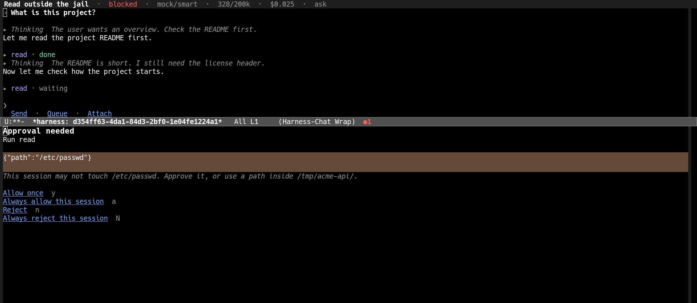
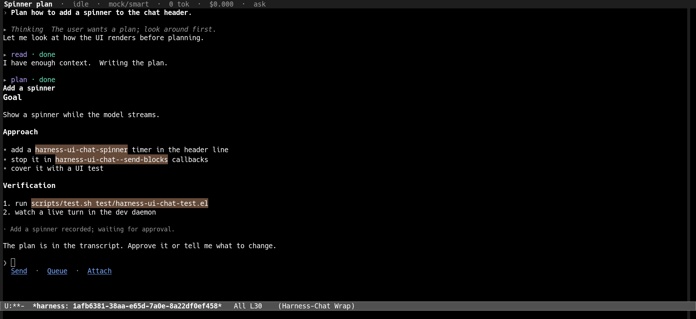

# Emacs Agent Harness

**The Magit of agentic harnesses.**  A modular coding agent whose business
logic is Emacs Lisp and whose interface is Emacs itself.  The state layer
speaks the Agent Client Protocol, and the Emacs UI is just another ACP
client — local over an in-process transport, or remote over TCP.


[](LICENSE)
[](https://www.gnu.org/software/emacs/)
[](#install)

[Demo](#watch-it-work) · [Install](#install) · [Quick start](#quick-start) ·
[Architecture](docs/architecture.md) · [Design](DESIGN.md)

## Why

Emacs is already the best place to read, edit, search and inspect code, and
it has fifty years of tooling that a terminal UI can only imitate.  An agent
that runs anywhere else is a window you visit; an agent that runs here is
part of the same buffer list, the same project, the same keyboard.

So the harness is built the way Emacs itself is: a kernel that only loads
modules and routes service calls and events, plus leaf modules for
providers, tools, permissions and config.  Every feature is replaceable, a
bare harness shows no UI and calls no model, and the UI talks to the state
layer over ACP instead of reaching into it — which is also why a remote UI
works out of the box.

## Watch it work


The clip is a real session, not a mock-up of one.  A prompt is typed by
hand; the agent thinks (collapsed, with the first line as a preview), calls
`read`, asks for approval in the panel at the bottom of the frame, and
streams a markdown answer.  The header tracks the session name, status,
model, context usage, cost and permission mode the whole time.  There is
also an [MP4 version](docs/media/demo.mp4).

## What it does

- **Sessions** — metadata plus ACP-shaped JSONL transcripts, scoped to a
  project, resumed from disk, forked, searched, renamed automatically, and
  drawn as a tree with sub-agents under their parents.
- **A real chat buffer** — markdown, collapsible thinking and tool calls, a
  queue, `@file` and `#skill` references, image and audio attachments,
  compaction, and a side conversation (`btw`) fork for quick questions.
- **Tools** — a sandboxed `bash`, native Emacs tools (read/write/edit,
  grep/glob/diff, org, elisp evaluation), skills, plan mode, sub-agent
  sessions, a merge queue for merging child work back, and web search.
- **Permissions** — allowed or rejected once or for the session, an
  optional cheap-model auto-approver, and a directory jail that asks
  before stepping outside the session's directory.
- **Providers** — any number of OpenAI-compatible endpoints (OpenAI,
  OpenRouter, DeepSeek, Ollama, LiteLLM, ...), plus the Claude CLI for
  subscription plans.  Models carry context windows and prices.
- **Usage and budgets** — every model call records timestamped usage, the
  report page breaks down spend by project and model, and hard budgets
  refuse turns before they are overrun.
- **Git worktrees** — create a worktree with a fresh branch and run a
  session inside it; the session list shows where each one runs.
- **Remote control** — run the harness on one machine and drive it from
  an Emacs on another over TCP, because the UI is only an ACP client.
- **Safe hot reload** — every source is compiled before it is swapped in,
  and the previous version is restored on failure, so a bad edit never
  kills a running session.

## Install

Emacs 28.1 or newer is required.  The bundle is self-locating:
`harness.el` puts the `lisp/` directories next to itself on `load-path`,
so a checkout works with only the repository root on `load-path`.  The
package is `harness`; `emacs-agent-harness` is only the repository.

### From a checkout

```elisp
(add-to-list 'load-path "/path/to/emacs-agent-harness")
(require 'harness)
(harness-start)
```

### straight.el

```elisp
(straight-use-package
 '(harness :type git :host sourcehut :repo "catvec/emacs-agent-harness"
           :files ("*.el" "README.md" "LICENSE"
                   "lisp/*.el" "lisp/modules/*.el"
                   "lisp/transports/*.el" "lisp/ui/*.el")))
```

(Keep the `:files` list as it is: straight generates autoloads only for
files in the package root, so the modules are flattened into the build
directory.  `harness.el` finds them either way.)

### Doom Emacs

In `~/.config/doom/packages.el`:

```elisp
(package! harness
  :recipe (:host sourcehut
           :repo "catvec/emacs-agent-harness"
           :files ("*.el" "README.md" "LICENSE"
                   "lisp/*.el" "lisp/modules/*.el"
                   "lisp/transports/*.el" "lisp/ui/*.el")))
```

In `~/.config/doom/config.el`:

```elisp
(use-package! harness
  :init
  ;; (setenv "OPENAI_API_KEY" "...")   ; or another provider's key
  :config
  ;; Start with Emacs.  Drop this line and run `M-x harness-start' by
  ;; hand if you prefer to start the harness per session.
  (harness-start))
```

Then `doom sync` and restart Emacs.  `harness-start` and the other
lifecycle commands are autoloaded.

### Using the checkout on disk instead of the published repository

Replace the remote URL with `:local-repo`; straight symlinks the checkout
into its build directory, so editing the files is enough (no
`git push` + `doom sync -u` round trip):

```elisp
(package! harness
  :recipe (:local-repo "~/documents/ai/emacs-agent-harness"
           :files ("*.el" "README.md" "LICENSE"
                   "lisp/*.el" "lisp/modules/*.el"
                   "lisp/transports/*.el" "lisp/ui/*.el")))
```

With `load-prefer-newer` non-nil and `M-x harness-auto-reload-mode` on,
saving a source file reloads the harness in place.  The mode follows the
symlinks straight creates and watches the true source directories, and
the reload compiles the edited source before swapping it in.

The same recipe works with plain straight:

```elisp
(straight-use-package
 '(harness :local-repo "~/documents/ai/emacs-agent-harness"
           :files ("*.el" "README.md" "LICENSE"
                   "lisp/*.el" "lisp/modules/*.el"
                   "lisp/transports/*.el" "lisp/ui/*.el")))
```

## Quick start

`harness-start` loads the default module set and connects the local UI.
Nothing starts before it: a bare harness never shows a UI or calls a
model.

Set an API key (or configure any OpenAI-compatible endpoint):

```elisp
(setenv "OPENAI_API_KEY" "...")
```

Then:

- `M-x harness-ui-chat-new` — create a session in a directory and open its chat.
- Type a message and press `RET`.
- `@` completes file references; `#name` attaches a skill.
- `C-c C-s` opens the session list, `C-c C-m` the model switcher.

## Chat buffer

| key | action |
|---|---|
| `RET` | send (or queue while the agent is running) |
| `S-RET`, `C-j` | newline in the message |
| `C-c C-c` / `C-c C-q` | send / queue explicitly |
| `C-c C-k` | cancel the running turn |
| `C-c C-s` | session list |
| `C-c C-m` | switch model |
| `C-c C-p` / `C-c C-t` | permission mode / thinking level |
| `C-c C-a` | attach a file |
| `C-c C-b` | ask in a side conversation (btw fork) |
| `C-c C-e` | jump back to the message box |
| `q` | bury the chat |

Every action also exists as a clickable button in the composer line.
Thinking and tool calls start collapsed (`▸`); click or press the toggle
to expand.  Collapsed thinking previews its first line, tool lines show
what they acted on and their status, and consecutive safe tool calls
(`read`, `glob`, `search`, ...) coalesce into a summary line so long
transcripts stay readable.

The agent can run work in a **sub-agent** session (`subagent` tool): a
full session parented to the current one, shown in the session list, whose
final report comes back as the tool result.

The header line shows the session name, status, model, context usage,
cost and permission mode.

## Permissions

Tool calls run through a permission chain.  By default the directory jail
asks before touching files outside the session directory; reads inside
the session are allowed.  Approvals appear in a focused panel at the
bottom of the frame:



- `y` allow once, `a` always allow this session
- `n` reject, `N` always reject
- `C-g` cancel (rejects)

The same chain can run in auto mode, where a cheap model decides, or in a
non-interactive mode for scripted sessions.

## Plan mode

In plan mode the agent is read-only and records a complete plan with the
`plan` tool before changing anything.  The plan renders as a styled block
in the transcript, and approval is an ordinary chat message.



## Sessions

`M-x harness-ui-sessions` shows the sessions of the current project (or
all with `s`), as a tree with forks and subagents under their parent.
`f` forks, `r` renames, `d` deletes, `RET` opens.  Sessions are scoped to
their project, resume from disk, and record token usage and cost.


## Usage and budgets

`M-x harness-ui-usage` (or `C-c C-u` in a chat) opens a full report:
total tokens and cost, spend for today/this week/this month, a graphical
breakdown by project and model, budgets, and a cost-sorted table of every
session.


Every model call appends a timestamped usage entry to the transcript, so
period reports are exact.  Configure budgets with
`harness-usage-budgets`:

```elisp
(setq harness-usage-budgets
      '((:scope project :project "/home/me/work/api"
         :period monthly :amount 25.0 :hard t)))
```

`:hard t` refuses new turns while the budget is exceeded (the agent
explains why in a hint); without it the budget is informational and shows
up in the report with a warning bar.

## Worktrees

`M-x harness-ui-worktrees` (or `C-c C-w` in a chat) manages git
worktrees of the session's repository: create one with a fresh branch and
open a session inside it, open or create a session in an existing
worktree, and remove worktrees you no longer need.  Sessions record their
worktree, so the session list and the conversation tree show where each
one runs.


## Merging work back

A forked or worktree session can ask to merge its changes into its
parent's working directory (the `merge` tool, also available to the
agent).  Requests queue on the parent and only one child holds the merge
window at a time; the parent pauses new turns while it does, the child
gets the parent's directory as an allowed path plus a normal turn that
asks it to apply its changes and resolve conflicts, and the window closes
when that turn ends (or after `harness-merge-lock-timeout`).

## Side conversations

`C-c C-b` opens a **btw** conversation: a fork of the current session in
a side window, asked immediately with your question.  The main session
keeps running untouched; the fork stays visible in the conversation tree,
and `q` closes the side window when you are done.

## Web search

`websearch` uses the Brave Search API.  Set `BRAVE_API_KEY` (or customize
`harness-search-brave-api-key`) to enable it; without a key the tool
explains what to configure.  Other backends plug in through
`harness-search-register-provider`, and the tool always uses the first
registered provider.

### Claude subscription plans

If the `claude` CLI is installed, the harness registers a `claude-cli`
provider that runs completions through it (print mode, stream-json).  It
appears in the model switcher as `claude-sonnet`, `claude-opus` and
`claude-haiku`.  Its own tools are disabled: the harness keeps its
permission model and its own tools.

## Completion providers

`harness-provider-openai-instances` configures any number of
OpenAI-compatible endpoints (OpenAI, OpenRouter, Ollama, ...); each
becomes a set of models in the model switcher.  Provide an API key
through the environment variable named in the instance, or configure
`:api-key` directly.  Models advertise a context window and prices when
known, which drive the usage display, cost tracking and compaction.

## Remote sessions

The harness runs an ACP agent, and the UI is an ACP client, so a UI can
drive a harness on another machine.  On the host, enable the server:

```elisp
(setq harness-acp-server-port 0           ; free port, recorded on disk
      harness-acp-server-host "127.0.0.1") ; keep it on loopback
```

On the client, `M-x harness-ui-connect`, give the host and the port from
`harness-acp-server-file` (use an ssh tunnel rather than binding the
server to a public address: ACP carries no authentication, and an agent
endpoint can run tools).

## How it is built

`harness.el` is only a bundle: a kernel plus the module set a normal
install loads.  The kernel knows nothing about agents or UI; it gives
modules a manifest, named services, typed events and a deferred
primitive.  Modules depend only on the kernel and the contracts they
declare, the state layer never requires a UI module, and the presentation
layer talks only ACP.  That is what makes each piece testable alone and
replaceable.  [docs/architecture.md](docs/architecture.md) is the API
contract; [DESIGN.md](DESIGN.md) is the product design.

## Status and limits

A pre-1.0 project, honest about the edges: MCP servers passed to
`session/new` are ignored (with a visible hint); video attachments open
externally and have no thumbnails; audio playback needs an external
player and microphone input is not implemented; the TCP agent endpoint
has no authentication, so keep it on loopback or behind an ssh tunnel.

## Development

`docs/dev-loop.md` describes the live development loop: a GUI Emacs
daemon that can be evaluated, driven with real keystrokes and captured
without stealing focus, which is how features are verified here.

- `scripts/lint.sh` compiles every file out of tree.
- `scripts/test.sh` runs the ERT suites.
- `scripts/media.sh` regenerates the screenshots and the demo video in
  `docs/media/`.

## License

GPL-3.0.  See [LICENSE](LICENSE).
