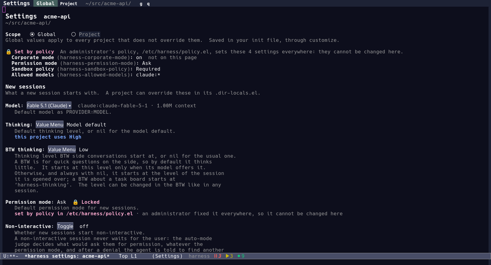

# Policy: settings an administrator fixes

A policy sets harness options to values the user cannot change: the
managed settings of a machine whose administrator decides what the
harness may do, in the spirit of Claude Code's managed settings.  The
code is `lisp/harness-policy.el`; this page is the design.



## Three states

Every setting is in one of three states:

| State | Its value | Who changes it |
|---|---|---|
| Unset | The option's default (its `defcustom`'s standard value) | Anyone, which makes it set |
| Set | The user's: their customizations (`setq`, `setopt`, Customize, the custom file), or for a setting that layers a project's or a directory's `.dir-locals.el` | The user, the settings page, ACP clients, agents through the harness's tools |
| Set by policy | The policy's, over every other layer | The administrator, by editing the policy file; no one else |

The first two are how settings work without a policy (the config module
layers directory over project over global, see the config section of
[architecture.md](architecture.md)).  The policy is a fourth layer above
them all, and the only one the user does not own.

## Where the policy lives

```
/etc/harness/policy.el
```

on Linux and macOS alike (`harness-policy-default-file`).  Why there:

- **The user cannot write it.**  `/etc` belongs to root on both
  systems (`/private/etc` on macOS, which `/etc` links to), so what the
  file says is what the administrator says.  That is the whole point:
  every source the user owns would let them lift the policy.
- **It is where administrators deploy configuration.**  Configuration
  management (Ansible, Puppet, Chef, Salt) and MDM tools (Jamf, Kandji,
  Intune) install files under `/etc` on both systems as a matter of
  course.  One path for both keeps the instructions and the support
  short.  (Claude Code uses `/Library/Application Support/ClaudeCode/`
  on macOS; a later version could read a second path there, but nothing
  needs it yet.)
- **Both processes can read it.**  The harness runs in two Emacs
  processes (see Processes in [architecture.md](architecture.md)): the
  user's Emacs and the harness process, an `emacs --batch -Q`.  Each
  reads the file itself.

The alternatives, and why not:

- **An environment variable naming the file.**  The environment belongs
  to the user: they can unset it, or point it at a file of their own.
  macOS GUI applications do not inherit a shell's environment either, so
  Emacs.app would often not see it at all.
- **site-lisp (`site-start.el`, `default.el`).**  The harness process
  starts with `-Q`, which skips both.  They are code, not data: the
  harness could not check them, only run them.  And their place depends
  on how Emacs was installed; under Homebrew it is owned by the user who
  installed Homebrew, not by root.
- **A user option.**  The user would set it.  `harness-policy-file`
  exists, as a plain variable, so the tests can point the harness at a
  file of their own; it is never forwarded to the harness process
  (`harness-server--own-variables`), which reads the default file.

## The file

The file holds one alist of options and their values, as a
`.dir-locals.el` file does.  It is read with `read`, never evaluated:
the values are data, written as they would be after a quote.

```elisp
;; /etc/harness/policy.el -- deployed by IT; read as data, never evaluated.
((harness-corporate-mode . t)
 (harness-disabled-modules . nil)
 (harness-permission-mode . ask)
 (harness-sandbox-policy . required)
 (harness-allowed-directories . ("~/work/"))
 (harness-perms-rules . ((:tool "web_fetch" :behavior deny)
                         (:path "~/.ssh/" :behavior deny)))
 (harness-allowed-models . ("claude:*" "bedrock:*")))
```

- Every entry is `(OPTION . VALUE)`.  OPTION is a harness option, named
  `harness-...`; each is set once.
- VALUE must fit the option's customize type, as Customize would check
  it.
- Comments are fine, and a file with nothing but comments is no policy.
- No file means no policy, and everything works as it always has.

Any harness option can be set; the options that make sense to set are
below.  Its value is the whole value: a policy that sets
`harness-perms-rules` sets the standing rules, all of them, and the user
adds none.

## What a policy value holds against

A policy value is applied the way Customize sets an option (its `:set`
function runs, so an option whose change must reach a running module
does), and then kept there:

| Way of changing a setting | What happens |
|---|---|
| The settings page | Shows the setting locked, with no way to change it; `config/set` and `config/unset` refuse it at every scope, so no other ACP client changes it either |
| `setopt`, Customize, `customize-set-variable`, the custom file | The option's `custom-set` function is the policy's: it keeps the policy value, with a warning once the harness has started |
| `setq`, `set-default` | A variable watcher refuses any other value with an error, so the value does not change.  The harness process defines and guards every option; the user's Emacs guards those it defines (the core's, the UI's), and a module's option set there only reaches the harness process, which keeps the policy's value |
| `.dir-locals.el`, file-local variables | The option is in `ignored-local-variables`, so no buffer gets a local value, and `config/get` gives the policy value whatever the files say |
| The harness's own saves (`harness-save-user-option`, the UI's customize-save chore) | Refused with the reason |
| Sessions (`session/update`, `session/set-all`, the task board's settings) | Refused for a setting the policy fixes; see Sessions below |
| Permission answers that would remember (Always allow, Always deny) | Not offered, and one given anyway holds for the session; see Permissions below |
| The remote control page (start and stop serving other devices) | Refused before anything listens or stops when the policy sets `harness-acp-remote` the other way |
| Agents | They change settings through the tools and methods above, so they meet the same refusals |

A let-binding and a buffer-local value pass the watcher: they end, and
they are how Lisp code works with a value for a while.  Nothing in the
harness changes a setting that way.

The refusal reads the same everywhere:

```
harness-permission-mode is set by policy (/etc/harness/policy.el) and cannot be changed
```

## When the policy is read

- `harness-start` reads the file first, before any module loads, and
  applies it to the options defined so far: those of `harness.el` and
  the core.  The modules to load are options too, so a policy decides
  them before they load.
- Once the modules have loaded and defined their options, it applies
  the policy again, to those, before any module starts.  (The harness
  process gets the user's values before the modules define the
  options; such an option takes the policy's value as its definition
  is evaluated, or, when it has a `:set` function of its own, at this
  second step.)
- `harness-reload` reads the file again.  A policy can change while
  the harness runs: what it sets now is applied, and what it no longer
  sets goes back to the user's value (customized, else saved, else the
  default).  Sessions are brought in line with the new policy.

Each process reads the file itself: the user's Emacs for the options it
defines (the core and the UI's), the harness process for every option.
The settings page shows what the harness process holds.  The few options
the harness process sets for itself before it starts
(`harness-server--own-variables`: that it is no UI, the modules it
loads, where it listens) describe that process rather than the user's
choices, so there the policy leaves them alone (`harness-policy-exempt`);
a policy that sets one, `harness-process` say, sets it in the user's
Emacs only.

## When the file cannot be trusted

A policy that is there but cannot be trusted stops the harness:
`harness-start` signals an error naming the file and the fault, and
nothing starts.  That covers a file that cannot be read (permissions, a
directory that hides it), one that is not one alist of `harness-`
options, one that sets an option twice, and a value its option's type
refuses.  Starting without the policy instead would quietly drop what
the administrator decided.

On reload, the same faults leave the policy in force as it was, and the
reload reports them.

An option the harness does not define (a policy written for a newer
harness, a module that is not installed, a typo) is reported once every
module has loaded, as a warning naming the file and the option, and
skipped.  The settings page lists it as "not a setting of this harness,
so it does nothing".  Failing would make every policy that names a new
option stop every older harness.

## What a policy means

Most options are settings like any other: the policy value is the value,
and that is all.  These need more, because the harness copies them, or
because a person answering a prompt changes them.

### Sessions

A session holds its own copy of the model (`harness-model`), the
permission mode (`harness-permission-mode`), the thinking level
(`harness-thinking`) and the non-interactive switch
(`harness-non-interactive`), taken from the settings when it is created.
When the policy sets one of these, every session has the policy's value:
new ones, forks, sub-agents, task sessions, sessions saved before the
policy came (when they are loaded) and those that exist when a reload
brings a new policy.  `session/update`, `session/set-all` and the task
board refuse another value, with the reason above.

A BTW thinks at `harness-btw-thinking` when its model offers that
level, so a policy on `harness-thinking` alone leaves a BTW's level to
that; set both to fix every session's.

### Permissions

- **Permission mode and non-interactive.**  The perms module reads the
  policy value for every request, whatever a session record says.
- **Standing rules** (`harness-perms-rules`).  The policy's rules are
  weighed before a session's own (the answers given for the session),
  so no answer overrides them.  No answer records a standing rule: the
  prompts leave out Always allow and Always deny, and one given anyway
  (an older client) holds for the session.
- **Allowed directories** (`harness-allowed-directories`).  The list is
  the policy's: no directory prompt offers Always allow, and the global
  entries cannot be revoked from the directory list.  A person in front
  of a prompt can still let a session reach a directory outside them,
  for the session or until the turn ends, as they can let any call run:
  the policy decides what is allowed without asking, not what the user
  may allow.
- **Sandbox** (`harness-sandbox-policy`).  `required` makes a command
  fail when it cannot be sandboxed: when no sandbox backend exists, as
  before, and now also when the sandbox module is not loaded, where a
  command used to run unconfined.

### Providers and models

`harness-allowed-models` keeps the harness to some models: a list of
patterns of model ids (`"claude:*"`, `"*:*sonnet*"`; a pattern without a
colon names a provider, so `"claude"` is `"claude:*"`), nil for any.
It is an option anyone can set, and a policy makes it binding:

- Every request for another model is refused before its provider sees
  it, in `provider/complete`, which every request passes: a session's,
  a task's, the auto-mode judge's, naming's, compaction's.  The session
  shows the reason.
- `provider/models` lists only the models allowed, so the model picker
  offers nothing else, and a provider's cheap or strong tier is chosen
  among them.
- `session/update` refuses another model.

A session already on a model the policy no longer allows keeps it, and
its next request fails with the reason; switching it to an allowed
model fixes that.  A policy that also sets `harness-model` fixes every
session's model instead (above).

Providers are modules (`provider-claude`, `provider-copilot`,
`provider-openai`, `provider-bedrock`, ...), so a policy drops one with
`harness-disabled-modules`, and fixes where one sends its requests by
setting its endpoints (`harness-openai-endpoints` for a company
gateway, `harness-bedrock-endpoints`).

### Modules

The harness's guards are modules too: the perms module decides
permissions, the sandbox module confines commands.  A policy that fixes
permission settings should also fix `harness-disabled-modules` (nil:
the user disables nothing; or the modules the company leaves out) and,
if it was changed, `harness-enabled-modules`, so that the modules it
relies on load.  The modules to load are read after the policy is
applied, so this holds from the start.

### Corporate mode

Corporate mode (`harness-corporate-mode`, see the README) is a setting
like the others, so a policy turns it on with
`(harness-corporate-mode . t)`.  It then cannot be turned off with
`setopt`, Customize or the init file.  The settings page does not show
the option, as before; its policy banner lists it as "not on this page".

## The settings page

A setting the policy sets is drawn with its value, a lock and "Locked",
in either scope, and with the reason under its description: "set by
policy in FILE · an administrator fixed it everywhere, so it cannot be
changed here".  It has no field, no menu and no reset, and the keys that
would change it (`C-c C-c`, `d`) say why they cannot.  A project's
override of it is not offered for removal: the policy wins over it.

A banner at the top names the policy file and lists every setting it
sets, those the page does not show (corporate mode) included.  The
Advanced section's count of settings changed leaves out the ones the
policy changed.

`config/describe` carries what the page needs: each setting's `:locked`
and `:source "policy"`, and `:policy`, the file and its entries.

## What it does not do

The policy holds against every way the harness, its settings page, its
ACP clients, its agents and Emacs's customization change a setting.  It
is no sandbox for Lisp.  Code the user runs in their own Emacs (their
init file, `harness-server-init-file`, a patched copy of the harness)
can do anything, as it can for any package: the file system, which
keeps the policy file out of the user's reach, is the boundary.  The
harness process runs no code from the user's configuration beyond what
it always did, and agents cannot evaluate Lisp in it (the `elisp` tool
runs in a separate `emacs --batch`).  In the user's Emacs they can,
through `emacs_eval`, unless `harness-emacs-eval` is off: a policy that
sets `(harness-emacs-eval . nil)` keeps them out of it too.

Kept out of the first version, to keep it small:

- Lists that a policy and the user both add to (policy rules plus the
  user's own, stricter ones).  A policy value is the whole value.
- Values the user may only make stricter (a permission mode stricter
  than the policy's).
- Policies per user or group, a directory of policy fragments, macOS
  configuration profiles, signed policies.

## Testing

The tests never read `/etc`: `test/harness-test-helpers.el` sets
`harness-policy-file` to nil, and `harness-test-with-policy` writes a
temporary policy file, loads and applies it around a body, and lifts it
afterwards.  `test/harness-policy-test.el` covers reading the file and
the guards; the config, session, perms, provider, tools-shell, server
and settings-page tests cover what a policy means there.
